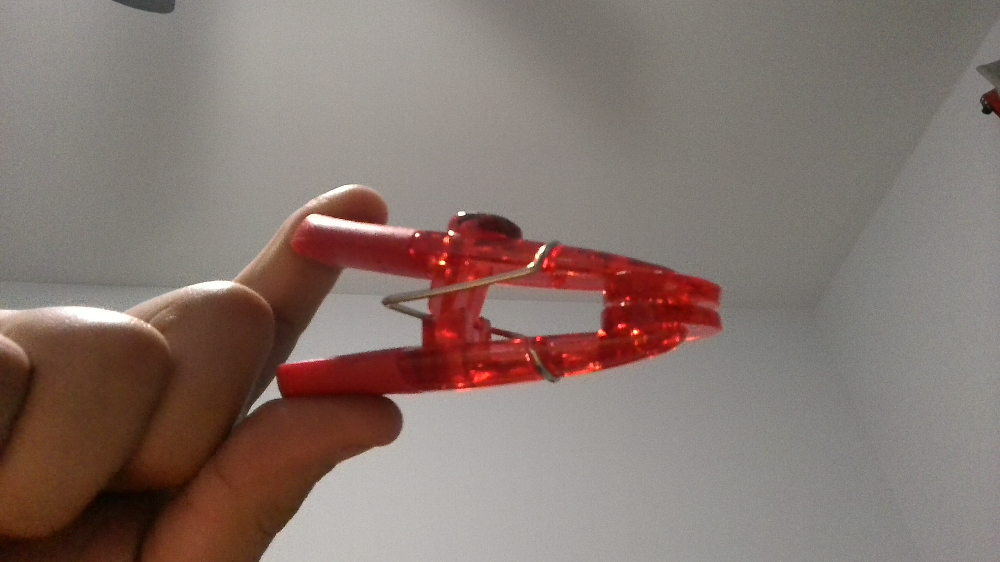
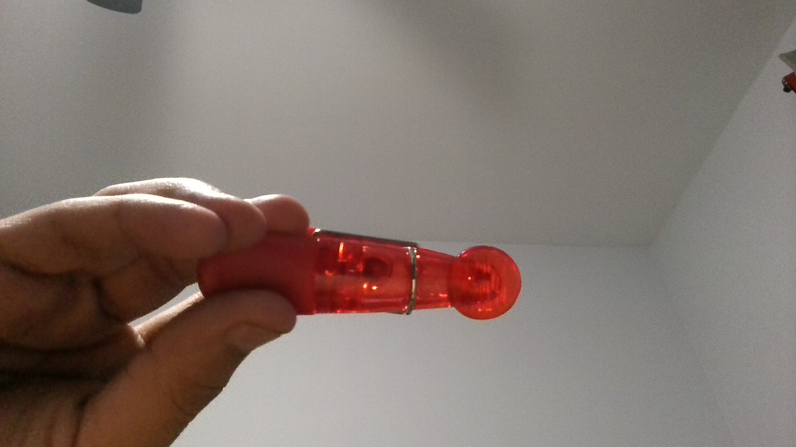
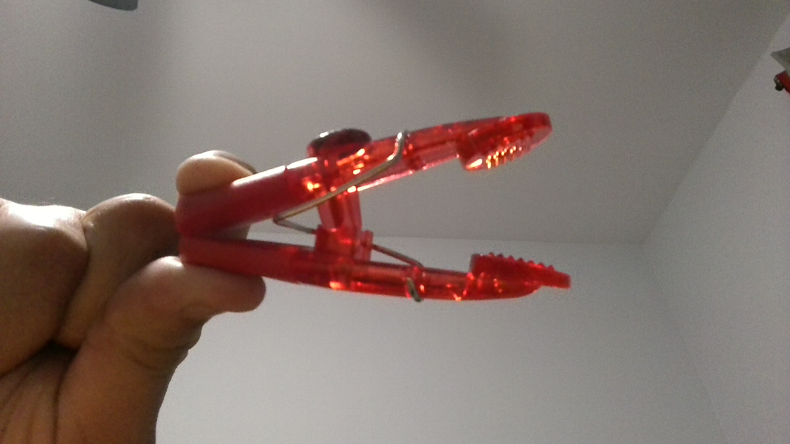

# A1 – [Create Portfolio]

## Objective
The goal of this assignment is to create a professional engineering portfolio site to setup for my future documentation in which I have to analyze engineering problems, create decisions, and communicate vividly so readers can imagine without having to see an image. This portfolio will document my improvement throughout the course on my ability to analyze engineering problems, create decisions, and communicate with logical well supported reasoning to back up my decision.

## Analyze
Portfolio #1- Brody Edgerton
a.  Navigability : 
The portfolio is very well laid out; it's a simple design where readers can easily navigate their way throughout the portfolio. With on the right side of the page being hyperlinks to its designated section such as "About Me" and each of their titled engineering assignments. Therefore, readers can easily navigate to locate the "About Me" section to get familiar with the owner and their work showcased beneath the "About Me" section. 

b.  Reproducibility : 
The documentation excels at explaining each step taken, it even goes further to give us the known values and what variable needed to be found. Almost all the decisions made were backed up with a reason why he chose that decision. The portfolio heavily depended on images to portray the information, because of these images it is possible that a colleague could reproduce the work without asking a question. That being said, the colleague must have knowledge and experience with SolidWorks and Autodesk Inventor to have the ability to reproduce the work without seeking help, since the documentation doesn't contain information on how to use these software's.

c.  Evidence of reasoning :
This portfolio shows how decisions were made, the portfolio made sure to explain very explicitly leaving behind little to no confusion to the readers. After every decision that was made, they made sure to at least have a sentence reasoning their choice.

d.  Professional tone :
The language in the portfolio would meet the standard of a document that I would hand to an employer as its simple words combined with engineering terms, facilitating the engineer reader to understand the documentation leading to the work being recreatable. They focused their efforts on presenting their work going straight to the point without any distractions. Although it could be said that it would've been better if in their portfolio they used the word "my" less often, make some better word choices.

Portfolio #2- Jacob Schwartz

a.  Navigability :
This portfolio uses a template that separates the projects, engineering bio, and contact information. In the projects tab each project has its own page, as well for the initial start and end date of the project. Therefore, any piece of work they created and inputted into their portfolio can quickly be found and navigated to under 60 seconds. After selecting a project of interest the general overview of the project is displayed. Although if you desire to view the complete report of the project your allowed to at the top of the projects page. Yet not all of the projects have a final report, for example the "Light Pole Photobot" doesn't, but the majority of projects displayed do consist of a final report.

b.  Reproducibility :
The documentation in the portfolio contains an immense load of information, enough to have a colleague reproduce the work without having to ask a question. This portfolio has some images to help with what the product should look like, but with the writing documentation alone it is possible to get a good imagine of what is being talked about. Images provided are helpful to see what the end result should look like as well they provide the dimensions of the design to replicate it. That being said, the projects the don't have a complete report of the project cannot be recreated without having to seek for assistance to create an identical design.

c.  Evidence of reasoning :
This portfolio could be an exemplary of proper reasoning to decisions. In the complete report of projects every change that was made to the design throughout the process was explained why it was changed for the better. Not only that it also described what was the better alternative and the reason why it is better compared to the prior choice.

d.  Professional tone : 
This portfolio is absolutely a document I would hand to an employer; it's appealing to the eye. The portfolio demonstrates that the person is very knowledgeable with the decisions made and why. Furthermore, the portfolio also uses engineering concepts showcasing proper analytical skills diagnosing issues, resolving with decision making, and overall communication.

Product Analysis- Bag clip
a.  (15%) What is the primary function of this product? State it as an engineering function : what mechanical task does it perform? State it precisely, not as a consumer description.
The primary function of a bag clip is to prevent air or other particles from entering the bag by providing a constant compressive clamping force onto the bag. The bag chip consists of a spring which holds one side of the clip shut at rest, but it has two handles in the opposite side to create a pinching motion with the handles to open up the jaw by using force to go against the resistance of the spring. When there isn't any force compressing the handles, the jaw goes back to its resting position due to the spring consistently desiring to go to its natural position; this creates that compressive clamping force to seal a bag airtight.

b.  Identify the governing model : what equation or physical principle governs its primary behavior?
i.  State the model and identify its variables.
The equation that governs the primary behavior of a bag clip is Torsional Hooke's Law, potential energy, and rotational kinetic energy.

Torsional Hooke's Law: T=kθ
T= Torque required to displace spring
k= Spring constant
θ= Angle of twist from origin

Potential Energy (when spring experiences an external force): U=(1/2)kx^2 (for springs)
U= Elastic potential energy
k= Spring constant
θ= Spring angle displacement

Rotational Kinetic Energy (when the bag clip is in movement of either opening or closing the jaw): K=(1/2)Iω^2
I= Moment of inertia
ω= Angular velocity of handle
 
ii.  State one assumption that makes the model valid for this product.
It is assumed that a spring is a proper mechanical device that is elastic, meaning it is able to flex without breaking, to clamp bags airtight due to its nature of wanting to return to it's resting postion.

c.  (15%) Take photographs of each component. Under each photograph, describe precisely how the geometry of that component affects its mechanical function.

Spring at rest, no external forces, so handles are separated creating that slim V shape.

Spring embedded towards the jaw end to create that compressive force seal due to the springs constant pressure to close.

External force on the handles greater than the resistance of the spring making the jaw open and creating a V shape once again but with the opening at opposite ends.
Patent research:
Patent Number: US D1,051,709 S
Authors: Albert Kassin and George Lai
i.  List at least two alternative solutions or devices that solve the same primary function.
Office clips are very similar to bag clips; therefore office clips can fulfill the purpose of bag clips extremely well preventing particles from going in the bag. Another alternative solution to bag clips is rubber bands. They can seal bags, but how efficient it is depends on how much force we want the rubber band to exert on the bag. This is because the more loops we create in a rubber the greater the force will be exerted by the rubber band. For example 2 loops around a bag will have more gaps for air to pass through compared to 3 loops. 3 loops around a bag will generate greater force and fewer micro gaps for air to seek through.

ii.  Identify one design decision the original engineer made : something you can see in the patent or geometry : and explain why you think they made that choice.
In the design the original engineer decided to add bumps on the handles. They must've made this choice because they know to open the jaw of a bag clip and maintain it open you must apply constant compressive force to the handles. Due to the spring fighting back it could be that the handle slips from your fingers and causes the bag clip to snap close. Therefore, these bumps will prevent the handles from slipping due to a greater static friction.

## Decide
1.  Homepage Identity : Your homepage is the entry point to a professional engineering record. What does a visitor need to know immediately to understand what this portfolio contains, how it is organized, and what standard it holds itself to? Write one paragraph justifying your homepage content decisions in terms of your intended reader : not in terms of yourself. The About Me section covers who you are. The homepage covers what this portfolio is.
This portfolio contains information about me, so that the reader, a possible employer, student, or professor can learn some general information about me so they can have the feeling of knowing me. The rest of this portfolio is purely engineering documentation of different assignments assigned throughout the course. Each assignment has sub parts where my analysis, decision making, and communication skills will showcase to the readers. The assignments are organized all under the assignments tab; so that the reader, a possible employer, student, or professor can navigate with ease to the assignments. Now, by having titles for each assignment will make readers feel like no time is wasted, meaning if they see a topic that doesn't interest them, they can skip over it; they don't need to click on the subtab to see what the assignment is about and if it interests them.

2.  One Intentional Customization : Identify one element of the template : color scheme, typography, logo, or section labels : and change it deliberately. Document what you changed, what requirement your change better satisfies, and why the template default did not meet that requirement. "I preferred it" is not a requirement. State the functional reason.
I changed a section label deliberately under "Assignments" for A1 to have the title "Create Portfolio". Throughout the course I'll be updating the section to have a title; this way it'll be quicker for the reader to navigate through the portfolio knowing what each assignment is about before even clicking on it.

3.  Your Documentation Standard : The template gives you the structure. You set the standard for what goes inside it. Write one sentence that defines the quality bar you are committing to for every assignment entry this semester. This is a self-imposed professional standard. You will be held to it. A student who writes a vague commitment will produce vague documentation all semester. Write the standard you actually intend to meet.
Throughout the semester I expect my documentation reports to improve my analysis, decision making, and engineering word choices. I intend to provide detailed reports of my assignments, so that readers can imagine what I am talking about without having to look at an imagine.

## Communicate
About Me
My name is Jeffrey Mendoza-Amaya, I am a Mechanical Engineering undergraduate student at the University of North Carolina at Charlotte. Its versatility is one of its most important reasons why I chose this specific engineering major compared to other engineering professions. I chose engineering because of my curiosity of how mechanical devices work and how it works well with different components. For this reason, Legos is a fun way to spend time and to build. Now, being at the University of North Carolina at Charlotte and seeing I can focus on Biomedical Engineer as a concentration really intrigues me. Therefore, I'm planning to get a bachelor's in mechanical engineering with a concentration in Biomedical. I've had the ambition to do both something medical related and engineering, Biomedical satisfies both conditions perfectly. The reason why the medical field interests me is because of my father being in the medical field; I want to do My future desired optimal job would be to innovate and build prosthetics. I want to contribute to society, to help people but specifically people who has medical needs of missing a body part. I will be a happy engineer when I can make patients live a better life by giving them the ability to live to the most of their life with a prosthetic. It would be world breaking news if prosthetics could be made affordable because there are numerous individuals missing a limb. I'm sure a prosthetics would make them happy giving them the ability to overcome obstacles and giving them the feeling of having their limb back.

The defending an engineering decision would mean being able to support your decision making with logical reasoning. As well strong back up evidence to convince readers would be to include related formulas, and if possible, to solve for variable of interest. This would verify the decision is a better alternative and would demonstrate the appreciate solution to the issue. Currently, I can defend simple engineering decision explaining my reasoning, but I know I have a lot to improve on. For example, my alternative solution search needs work and I would like to strongly defend my engineering decision by consistently showing calculations of the appropriate solution.

Time Spent
Roughly about 7-8 hours was spent on this assignment, analyzing portfolios, identifying a product and its mechanical formulas, and writing personal information.

