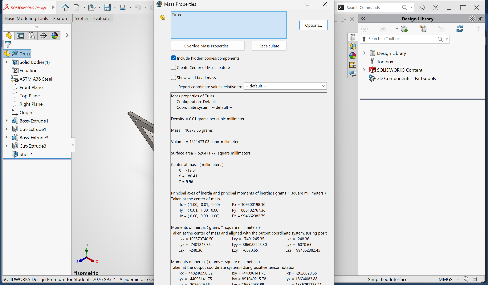

# A2 – Truss Stress Analysis

## Objective
The purpose of this assignment is to design a lightweight planar truss using A500 steel or an alternative material. Create free body diagrams (FBDs) for joints and critical pins. Calculate the required cross-sectional area of truss elements with a safety factor. Determine pin sizes based on shear forces with a safety factor. Solve equations symbolically and numerically for both truss and pin design. Estimate the total weight of the truss and pins. Create a CAD model with accurate dimensions and connections. Compare CAD weight predictions with hand calculations. Document key engineering lessons learned from the process.
## Analyze
For this assignment I got tasked to create and 3D model a truss with the given constraints. 

## Truss Analysis

I'm given that point A is a pin and point B is a roller. Also, I'm given that the length of a is 0.4m and length of b is 0.3m. I was given the choice to choose the value of the external forces of the truss, a value between 20-30kN. I decided to use the value 27 for this assignment. Furthermore, our truss needs to be lightweight, its material has to be A500 steel or a similar alternative.

Since our truss has to be light weight, I want to minimize the quantity of beams connected to the truss. Yet, I need to ensure that the truss will be able to support the load. Therefore, to maximize the strength of the truss I designed triangular geometry shape within the truss. 

This is how the truss now looks like with its given dimensions added and choice of force. The next step will be to determine the reaction forces at point A and B, before finding the forces for each member within the truss. For each force I'll draw an arrow for the direction I assume the is. If the calculation of the value, I find is negative I'll flip the arrow so that the calculation can be positive. Also, by doing this the arrow will be pointing in the correct direction whether the point is experiencing compression or tension from the beam. It is also important to keep in mind that the rotation when finding the moment about a point determines the operation sign; counterclockwise rotation gives a positive value while a clockwise rotation gives a negative value.
## Truss Internal Forces 

Therefore, I start calculating the reaction forces at point A and B, there are 3 reaction forces I need to solve for. Point A is a pin; therefore, it has two unknown reaction forces, one on the x-axis and another in the y-axis, this is because it can't move in the x direction nor the y direction. Applying the same concept at point B means there is only one unknown reaction force at this point, in the y direction. The quantity and direction of reaction forces are determined by imagining on what axis the support can't freely move; there'll be a reaction force in that same direction the support can't freely move. For example, point B has a roller which can move freely in the x direction, therefore, it must have a reaction force on the y-axis since movement on the y-axis is prevented. Ideally when finding 3 reaction forces with 2 supports it would be best to take the moment of the support with the 2 unknown reaction forces. This way the 2 unknown forces at that one support would cancel out, leaving only 1 unknown reaction force to solve for. To calculate moment the formula is the sum of Force*Distance (perpendicular to the force) for each force. By taking the moment about point A the distance is equal to 0, so the values will be 0. Therefore, I was able to calculate By, then to calculate Ax and Ay I summed up the forces in the x and y direction separately to find Ax and Ay.

This section includes all the member force calculations with acknowledgment whether the point experiences compression or tension from each member. Also, since I designed the truss, I had to find the angles by using inverse tangent. Fortunately, length and height remained constant throughout the truss meaning isosceles triangles split into right triangles. Therefore, the angle will remain constant at the opposite ends of the isosceles triangle. For the left portion of the truss there isn't an isosceles triangle but there still are right triangles of the same length and height, so the angles can be found by comparing to the previous calculated right triangles. It was best to start by finding the forces at point A first, since there was only one unknown in the y-axis which could be calculated straight forward. After calculating point A I calculated point F since there was only 1 unknown in each the x and y direction. Then, I had decided to calculate for point D just to realize midway that it would be better to calculate point B and C first due to fewer unknowns. This way I would also have less unknown to solve for at point D, because solving internal forces for point C would let me find force in member CD, only 1 unknown at point D.
## Truss Minimal Area & Beam Selection

Knowing the forces that act upon the members of the truss I had to find a minimum cross-sectional area that would be able to withstand the loads. Therefore, to calculate the minimum cross-sectional area required I used the stress formula (stress= Force/Area) and symbolically solved for the area to get the minimum cross-sectional area is equal to the force divided by the stress. Given I chose ASTM A36 steel, since there isn't A500 steel in SolidWorks and it's the most similar, I know the yield strength of the material thanks to this [data table](https://ficientdesign.com/a36-steel-properties/). The force used in the calculation was the largest force the truss experienced on a beam. The reason the largest force was chosen is to make sure the beam with the largest force wouldn't fail under the load; as well to make sure that each beam has the same cross-sectional area. Therefore, knowing my stress and forces allows me to calculate the minimum cross-sectional area for the beams. This calculates to a minimum of 90mm^2, but since there is a safety factor of 3.5 the new minimal cross-sectional area is 315mm^2.

Since I decided to go with a hollow rectangular tube as my beam shape because I thought about how a rectangular hollow tube could be more efficient than a solid beam. A load on a hollow tube can be distributed along the length of the beam whereas a solid beam would feel the load at that specific spot. So, to prove this I calculated the area moment of inertia for both the solid and hollow rectangular tube to determine the stiffness. The knowns are the inner width (b), inner height (h), outer width (B), and outer height (H). Our only unknown is the stiffness for the geometric shape. The base of the solid would be 20mm (b) x 20mm (h) to equal a cross-sectional area of 400mm, since the hollow truss cross-sectional area is 400mm with a thickness of 5mm. The outer dimension of the hollow tube is 20mm (B) and 30mm (H); the inner is 20mm (b) and 10mm (h). In the calculations it was found that the solid is more prone to bending/snapping, the hollow rectangular tube is approximately 3x stronger.

Therefore, due to choosing a hollow inside I had to calculate for the minimum thickness of the tube considering the cross-sectional area has to be a minimum of 315mm^2.
I used a formula which allowed me to calculate for the area of a hollow rectangular tube; which was rearranged to solve for the thickness of the tube. The thick of the tube for the beams has to be a minimum of 3.70mm thick, but for safety I decided to go with a wall thickness of 5mm. The total dimensions I chose is 20mm(width)x 30mm(height) with a 5mm wall thickness. So, the empty space inside the tube is 20mm x 10mm. 
## Truss Weight

To find the weight of the truss the formula cross-sectional area times density equals weight per unit length is used. The density was found from the [data table](https://ficientdesign.com/a36-steel-properties/) previously used and the cross-sectional area is known, we just need the input to calculate weight per unit length. The weight per unit length is calculated to be 3.144kg/m. Now, to find the weight for the whole truss I calculated the length of the hypotenuse using the Pythagorean Theorem to find the unknown diagonal it to be 0.5m or 500mm. Then, I added all the lengths of the x-axis beams, y-axis beams, and the diagonal beams, which equals 3.7m or 370mm. Multiplying the weight per unit length times the total beam length would cancel out the unit length giving the total weight of the truss, equaling 11.63kg.
## Pin Area and Weight

To find the cross-sectional area of the pins the shear stress formula is used. Allowable shear stress is the given yield stress divided by the given safety factor. Now, this can be replaced for tau, the symbol of shear stress. Therefore, it will be, after rearranging, the cross-sectional area is equal to the (safety factor*largest force)/yield strength. Giving a value of 0.119in^2 or 76.77mm^2 for the minimum cross-sectional area for the pin.

[My Image](weightofpins.png)

Finding the weight of the pins was a similar process to find the weight of the truss using the same formulas. Knowing our minimum cross-sectional area for the pins and the density for the material of the pins the weight per unit length was found to be 0.033lb/in. Once again, this value times the length of the pin will give the value for the weight of the pins. I decided the pins to be flanged welded studs of 10mm or 0.3937in length to make sure it passed through one side of the wall, not pass both walls of the beam as it would make the beam lose structural integrity. Also, passing the stud through both sides of the beam would make it double shear connection. Therefore, the flanged welded studs are an ideal candidate for single shear connections. That being said, the cross-sectional area x 0.3937in length equals 0.0130lb per pin. Since there is going to be a pin at every joint this value is multiplied by 6 to account the weight of all 6 pins, equaling 0.078lb or 0.03538kg.
## Truss CAD Model

Firstly, I outlined the truss with the proper dimensions in mm, 400mm horizontally and 300mm vertically with a total length of 1200mm.

Then, I boss extruded the outline of the truss to 20mm; because I decided the width of the truss to be 20mm and the height 30mm to equal 600mm to met the required minimum cross-sectional area when the empty space is subtracted.

Now, I decided to eliminate the center by extrude cutting it, meaning I would later have to boss extrude again to add the missing beams. It would be less steps by just sketching the 4 separate triangles within the truss and extrude cutting it to create all our desired beams.

After, cutting the inner side of the truss I had to add 3 beams to complete my truss. Therefore, I drew 3 rectangles for the 3 beams and added dimensions to it. Each beam was 30mm in height and drew the rectangles overlapping as it shouldn't matter, it'll be extruded the same. The 15mm is just to ensure the diagonal beam is in the center.

After extruding the 3 beams 20mm (width) the truss was completed. This is the truss without the pins.

One last step to fully complete the truss was to add the empty space inside as originally calculated. To successfully do this I used the shell feature to create a hollow inside. The only thing that was necessary to input into the feature was the desired thickness of the wall, which for me is 5mm. Afterwards, to verify that the empty space was successfully created I went to the section view feature; under the header section 1 I selected right plane so that my truss could be cut from the right side so the inside of the truss can be viewed. I also had created holes where the flanged welded stud would be located.

## Pin CAD Model

For the flanged welded stud, I simply made two circles, one diameter 9.89mm (the minimum pin diameter) and the other 15mm acting as a washer. Then the outer circle was extruded to 2mm, while the stud was extruded to 8mm to make sure it passes through the thickness of one side of the wall.

This is the finished product of the flanged welded stud with a fillet to create smoother edge.
## Final CAD Model

At this point my truss is set with the welded studs to hold the joints together. I had gone into assembly to add both the files of the truss and the pin (stud) and put the pins on the truss, in its designated pin hole that was created, using mate feature. I had to add the file of the pin 6 times for the 6 pins and made sure to lock it so it wouldn't move after being placed, using the mate feature.
## Software Weight Calculations

The weight of just the truss design is 10373.56 grams which is equivalent to 10.374kg and I had calculated the truss to be 11.63kg. Therefore, my calculations is slightly off, although the removed mass for the pins also account for the mass calculated by SolidWorks to be lower. Yet, I believe the mass of the truss without the pin holes would still be slighty lower compared to my written calculations.

According to SolidWorks the mass of the designed truss with the pins is 22.97 lbs. or 10.419kg. Subtracting this by the weight of just the truss calculates to 0.045kg, since there are 6 pins this number iyields divided by 6 to give a weight value of 0.0075kg per pin. That being said, SolidWorks computations vs my written calculations are relatively close.

## Geometric Design Decision
The geometric shape I selected are triangles, because they are the strongest geometric shape due to its rigidness and ability to distribute loads evenly. I was debating how the center diagonal beam should be placed and decided top left to bottom right. I chose the beam to be like this considering the loads. The load coming from the center left bottom is pushing up while the load on the center right bottom is pulling down. Therefore, due to these loads there would be a twisting sort of action on the truss. To minimize it I added the diagonal beam as described so that the load pushing up can be distributed through more beams putting less stress on a specific beam. For the load pulling down, now it is also held by the diagonal beam welded at joint E. This beam increases the overall truss stability and stiffness to prevent unwanted outcomes. Also, earlier I had stated why I chose a hollow interior rather than a solid beam, since it is stiffer.

## Engineering Lesson
Overall, from this assignment I learned how use statics and solid mechanics to create a stable truss. I learned how to calculate the minimal cross-sectional area for a truss so it can support the largest force that the truss experiences. Afterwords, I learned how to calculate the minimal pin diameter using the cross-sectional area of the pins. Additionally, I learned that a hollow rectangular tube is stiffer than a solid rectangular beam by using the Area Moment of Inertia formula. I found out that weight can be calculated by multiplying the cross-sectional area, density, and length, which makes sense. This is basically the d=m/v formula as the cross-sectional area times length is the volume. This assignment helped me strengthen my solid mechanics knowledge and overall engineering skills.

## Likelihood of Failure Modes in Truss Members

Truss members that are in compression are prone to buckling, which can even happen before the material reaches its yield strength, if the slenderness ratio is high. While members that experience tension tend to fail due to material yielding, by the increase in stress. ASTM A36 is widely used to withstand heavy loads being a popular choice for relatively cheap and ductile. Therefore, it can bend and return it its original form, but once it passes its elastic limit it will be permanently deformed. Since high slenderness causes members in compression to buckle it is ideal to decrease the length of the member to make the member more rigid. Another option would be to increase the cross-sectional are as this would minimize the stress (sigma=F/A). Whereas, for members in tension which tend to fail due to material yielding. According to the stress formula where stress=F/A if the cross-sectional of the member is too small compared to the force it'll snap due to the tension stretching the material past its yield point. So, increasing cross-sectional area will prevent this stretch which can lead to a failure, minimizing stress on the member. Also, choosing a stiffer material would be less likely to be stretched under the same load.

## Likelihood of Failure Modes in Pin Connections

## Citations

[https://sensazioni.org/tension-compression-truss-members](https://ficientdesign.com/a36-steel-properties/)
[https://www.bushwickmetals.com/a36-steel-plates-properties-uses-an-overview/](https://www.bushwickmetals.com/a36-steel-plates-properties-uses-an-overview/)
