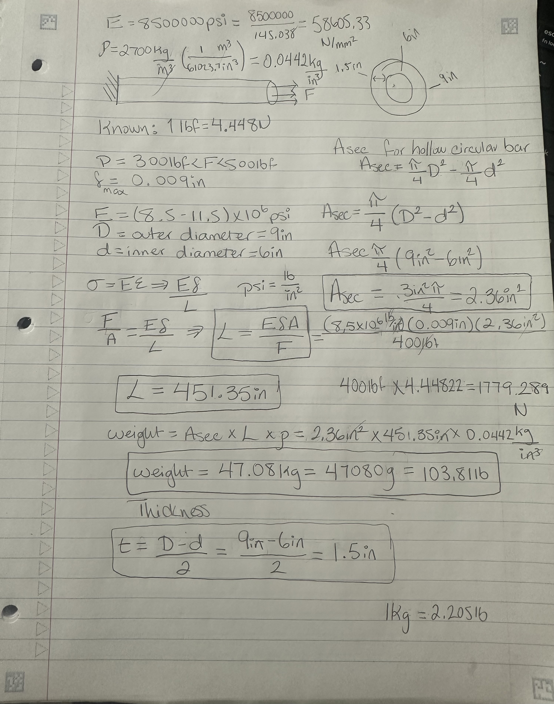
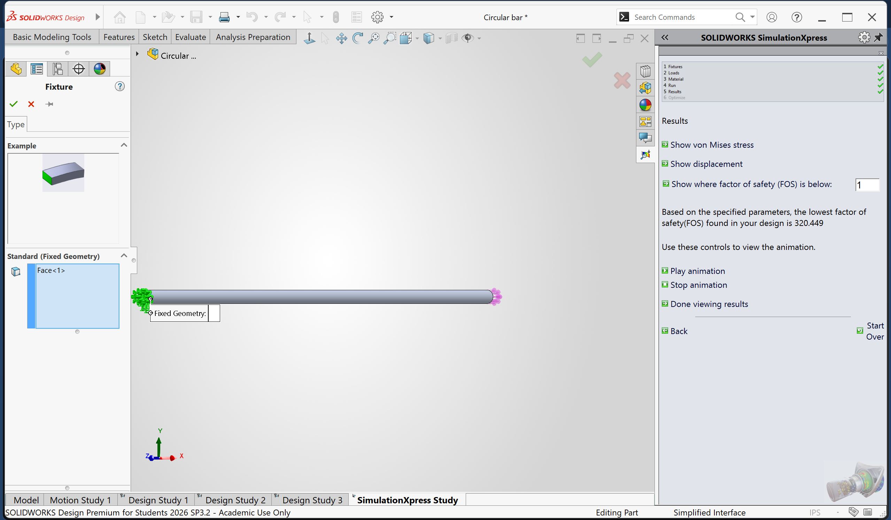
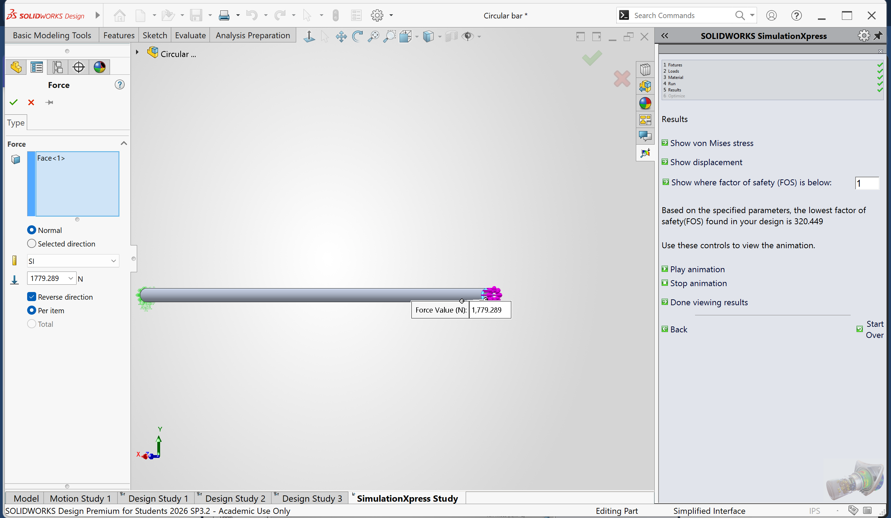
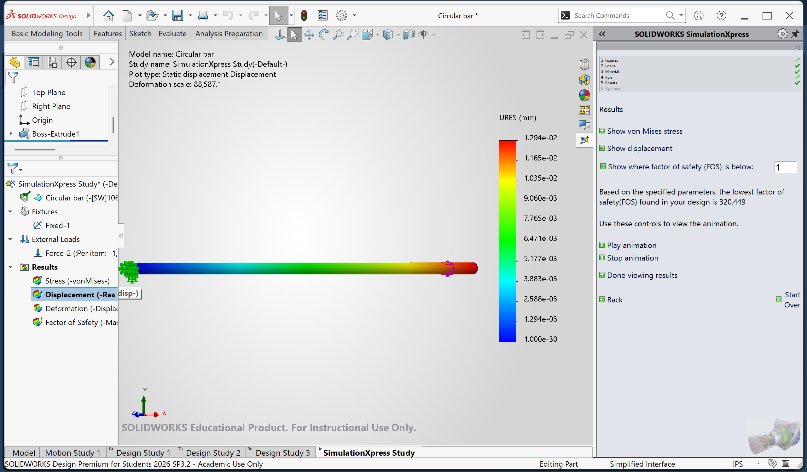
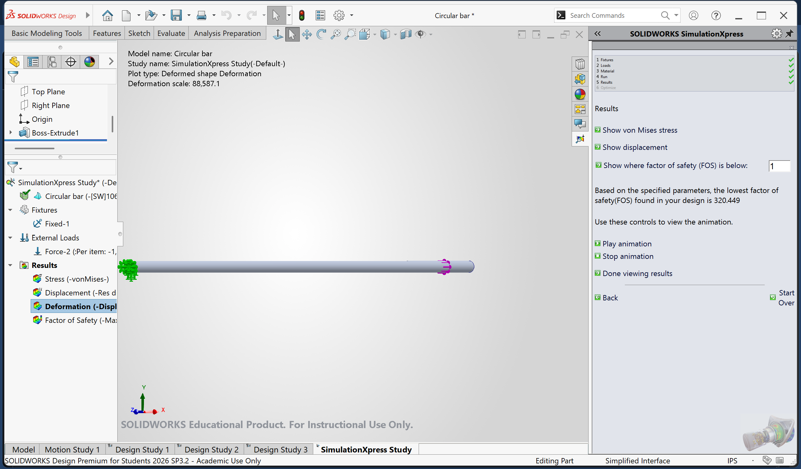
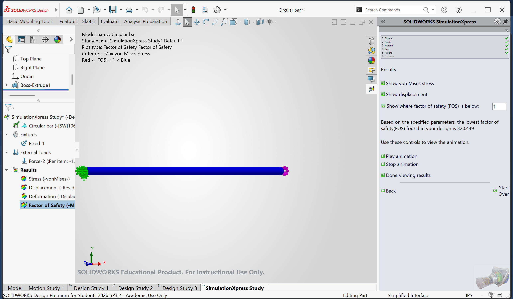

# A3 – [Topic]

## Objective
Design for stiffness by designing a bar using two types of analysis, axial deflection modeling to design its dimensions using parametric design to determine a bars length and get introduced to FEA (Finite Element Analysis). With a max bar axial deflection of 0.009in, material of Aluminum, circular cross-sectional area, and a direct load between 300lbf-500lbf. Get introduced to linking dimensions to appropriate parameters in CAD and compare and contrast the different analysis.

## Analyze

The "Equations" feature was used to input "Global Variables" so that each variable can gain a value. Therefore, all the known variables were inputted to use later on throughout the CAD model.

After, I started on the circular cross-sectional area by giving the outer diameter its Global Variable value of 9in. Next was the inner diameter which was given a value of 6in. When inputting these values I made sure it was computed with the value from the Global Variables feature, by adding an equal sign before the diameter value.

When the diameters of the rod were ready, the circles were extruded using the boss extrude feature, the rod was extended to 451.35in. This was the determined minimal length required based on the given information and selected dimensions for diameter.

Rod after extrusion.

Next up was the use of the fixed geometry feature, I made the left edge or face of the rod fixed so that it wouldn't move when tested.

Afterwards, on the other edge or face of the rod I applied the force of 400lbf or 1779.2N using the external loads feature.

Before testing the circular hollow rod, I made sure to apply the aluminum material so that the calculations would input the material property such as modulus of elasticity. I used Aluminum 1060 Alloy with a value of 69000N/mm^2 for modulus of elasticity which is equal to 10.007x10^6psi. N/mm^2=psi/145.038

## Decide

## Communicate
