# A3 – [Parametric and FEA]

## Objective
Design for stiffness by designing a bar using two types of analysis, axial deflection modeling to design its dimensions using parametric design to determine a bars length and get introduced to FEA (Finite Element Analysis). With a max bar axial deflection of 0.009in, material of Aluminum, circular cross-sectional area, and a direct load between 300lbf-500lbf. Get introduced to linking dimensions to appropriate parameters in CAD and compare and contrast the different analysis.

## Analyze

# Parametric Design
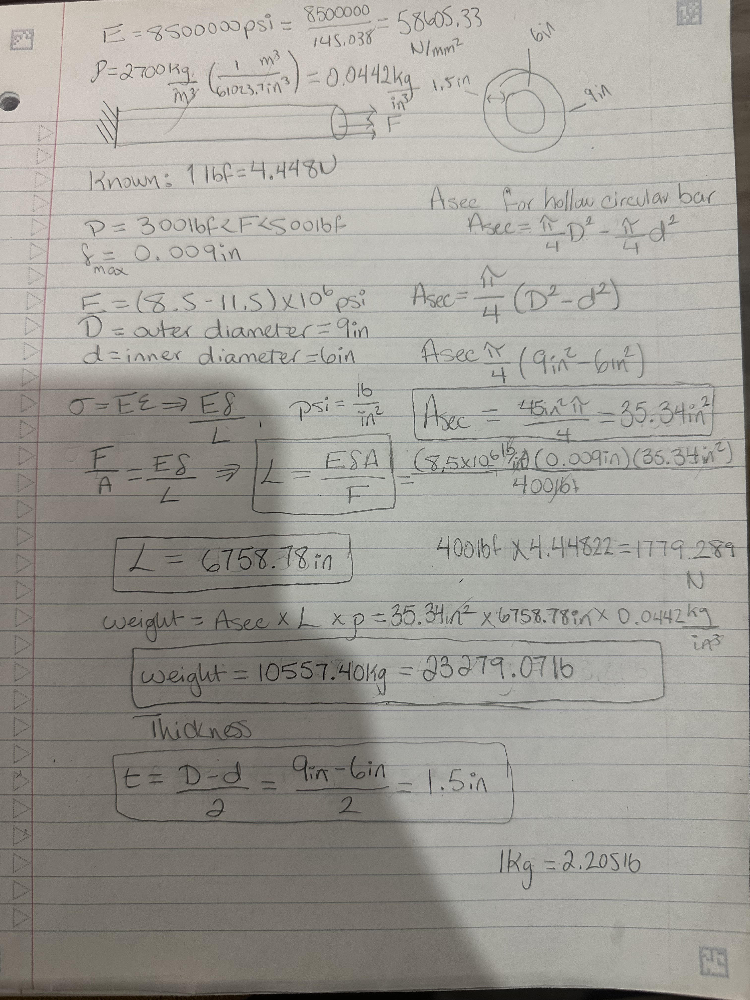

I had the decision to choose the values for the cross-sectional area of the circular bar. Therefore, since it has to be hollow there must be 2 diameters, an inner and outer diameter. That being said the formula for the cross-sectional area is 3.14(diameter outer^2- diameter inner^2)/4. Therefore, I chose the values to be 9in for the outer diameter and 6in for the inner diameter. With these values the cross-sectional area of the hollow circular rod comes out to 35.34in^2. Thickness is the outer diameter minus the inner diameter divided by 2 to give us a thickness of 1.5in. In this assignment it was allowed to choose a force value between 300lbf-500lbf; it is also allowed to choose the modulus of elasticity value within the range of 8.5x10^6-11.5x10^6psi. So, I choose the force value of 400lbf or 1779.289N and the modulus of elasticity to be the lowest, 8.5x10^6psi. Also, being able to choose our area, force, and modulus of elasticity allows for the length required to be found knowing the max axial deflection, modulus of elasticity, force, and area. After inputting values I found that a minimum length of 6758.78in is required to have a maximum deflection of 0.009in, which seems kinda lengthy.

##CAD Parameters

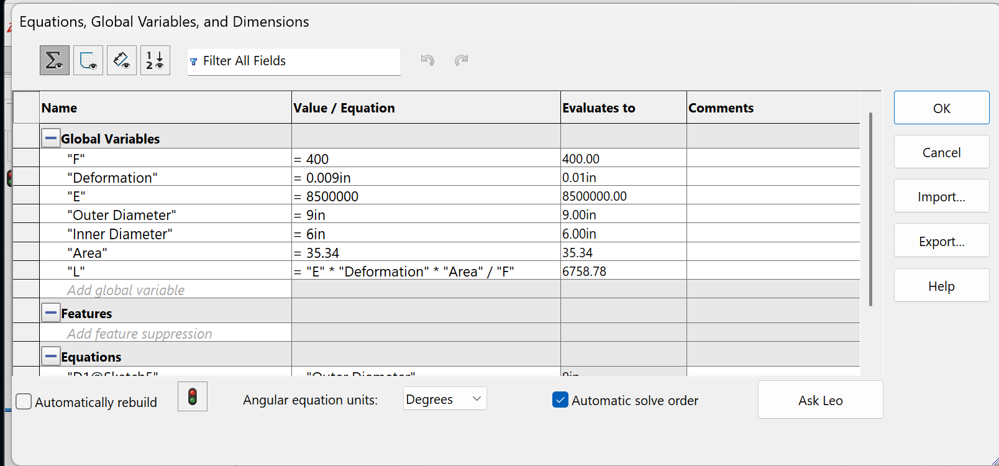

The "Equations" feature was used to input "Global Variables" so that each variable can gain a value. Therefore, all the known variables were inputted to use later on throughout the CAD model. Yet, for the value of length we used the same formula previously used to find length. Operations using the global variables was used to find the length on Solid Works. Solid Works computed the value 6758.78in for the length, which is the same value I calcualted.

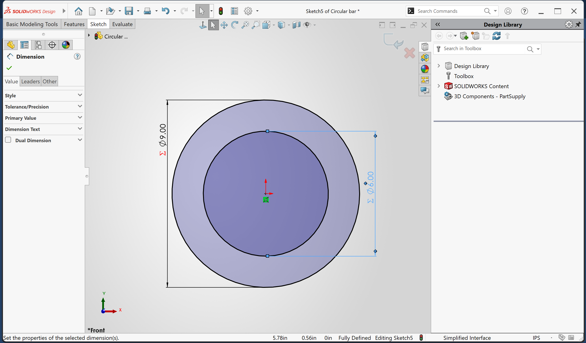

After, I started on the circular cross-sectional area by giving the outer diameter its Global Variable value of 9in. Next was the inner diameter which was given a value of 6in. When inputting these values I made sure it was computed with the value from the Global Variables feature, by adding an equal sign before the diameter value, giving the sigma symbol.

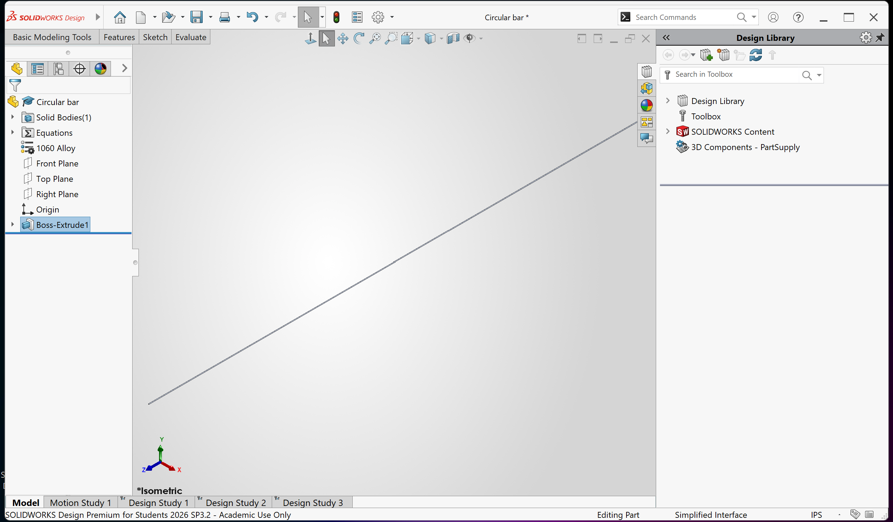

When the diameters of the rod were ready, the circles were extruded using the boss extrude feature, the rod was extended to 6758.78in. This was the determined minimal length required based on the given information and selected dimensions for diameter.

##CAD Fixed Geometry and Force Feature
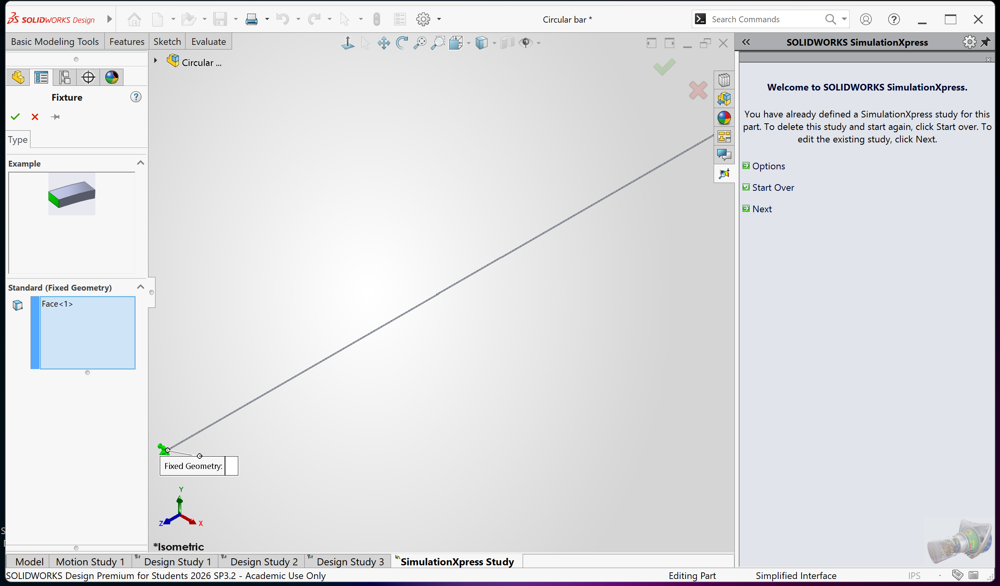

Next up was the use of the fixed geometry feature, I made the left edge or face of the rod fixed so that it wouldn't move when tested.

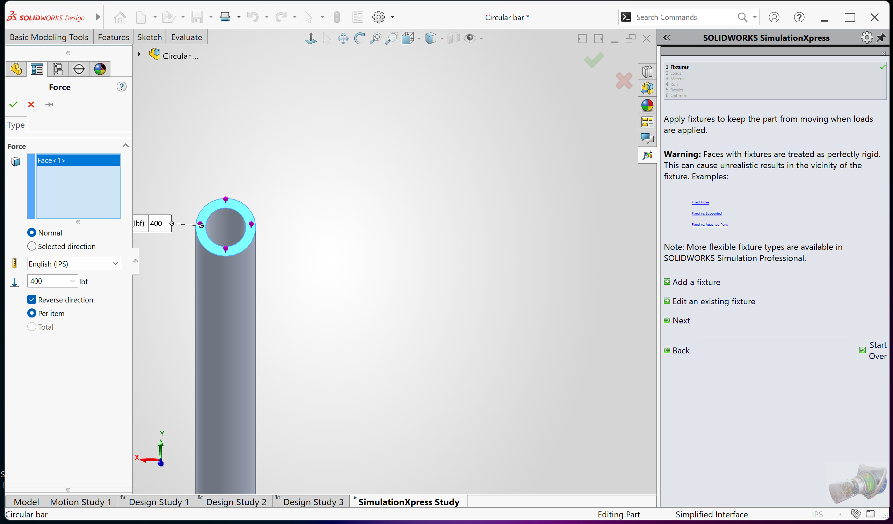

Afterwards, on the other edge or face of the rod I applied the force of 400lbf using the external loads feature.

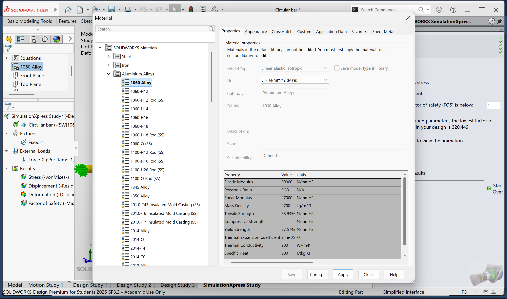

Before testing the circular hollow rod, I made sure to apply the aluminum material so that the calculations would input the material property such as modulus of elasticity. I used Aluminum 1060 Alloy with a value of 69000N/mm^2 for modulus of elasticity which is equal to 10.007x10^6psi. N/mm^2=psi/145.038

##CAD Diagrams
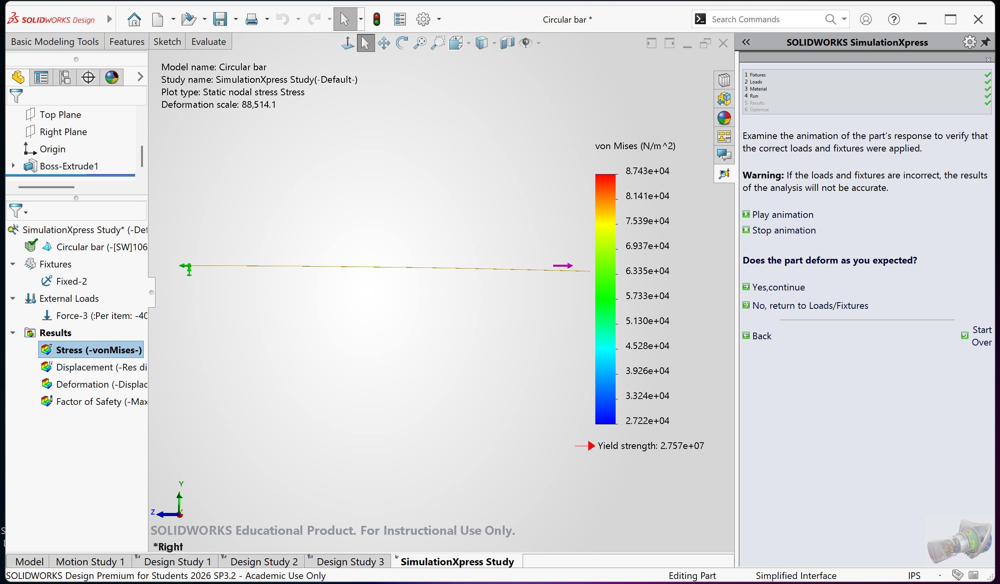

According to the test the maximum stress experienced by the beam is 8.743x10^4N/m^2. This is lower than the strength of aluminum of 40psi or 2.7579x10^8N/m^2 and the strength of the 1060 alloy valued at 2.757x10^7N/m^2. To find the safety of factor the formula is, SF= yield strength/ stress max. So, using the value from outline, SF= 2.7579x10^8N/m^2 / 8.743x10^4N/m^2= a safety factor of 3154.41. Whereas, using the value from SolidWorks SF= 2.757x10^7N/m^2 / 8.743x10^4N/m^2 = a safety factor of 315.44. That being said, the experienced stress is significantly lower than both yield strengths.

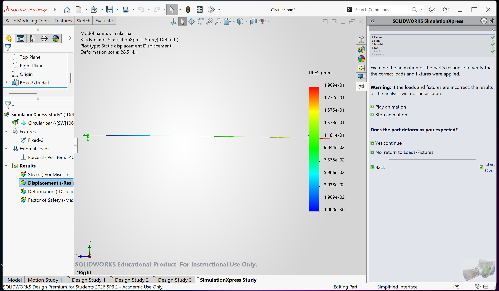

This graph shows the axial deflection of the bar to be a maximum of 1.969x10^-1mm= 0.1969mm= 0.007752in. Our allowed max axial deflection is no more than 0.009in, meaning the circular rod I created satisfied the condition being under 0.009in axial deflection. 

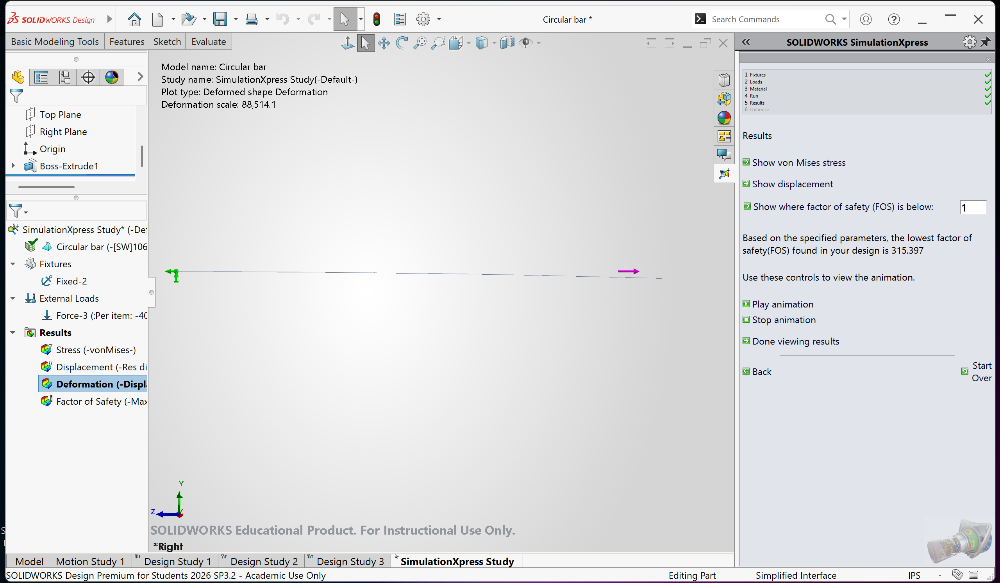

This CAD image shows the deformation of the model.

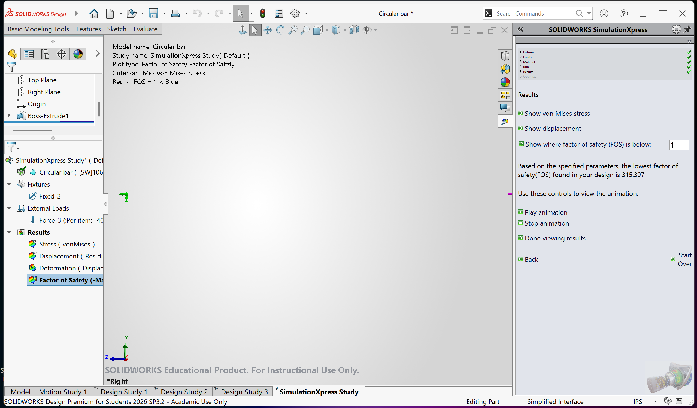

This calculates the factor of safety and got the same value I had gotten of 315 with slightly different decimal values, due to rounding most likely. 

## Design Reflection

From the parametric written calculation, I had used the maximum axial deflection value of 0.009 to find my length. Therefore, 0.009in should've been the max displacement experienced on the rod during the test. Yet, the maximum displacement calculated by SolidWorks during the study is 0.007752in, a lower value then what it should've been. The percent difference is 2(value difference)/(sum of values)*100. 2(0.009-0.007752)/(0.009+0.007752)*100= 14.9% difference between the two values. The reason for the percentage difference is due to the value of the modulus of elasticity. In the written calculation the modulus of elasticity value used was 58605.33N/mm^2 while the SolidWorks calculation used the material's property of 69000N/mm^2 for modulus of elasticity, leading to a different axial deflection value. The result from SolidWorks is more trustworthy because it has the actual modulus of elasticity for the material used, whereas my written calculation uses a random number between (8.5-11.5)x10^6psi.

## Engineering Lesson & Mistakes

From this assignment I learned how input values that correspond to a variable using the "Equations" feature to create, what is called, global variables which can be used when creating dimensions. Additional knowledge gained is how to test designs I create on SolidWorks to check its stress, displacement, deformation, and factor of safety. Furthermore, I learned how to read and calculate the safeness of the design, by using the legend created in SolidWorks and comparing it to the yield strength, max axial deflection, or written calculations for the safety factor. I had forgotten to square my diameters when finding the cross-sectional area leading to inaccurate calculations and testing later on. Therefore, I had to redo the SolidWorks testing with the correct cross-sectional area to gain accurate information. 

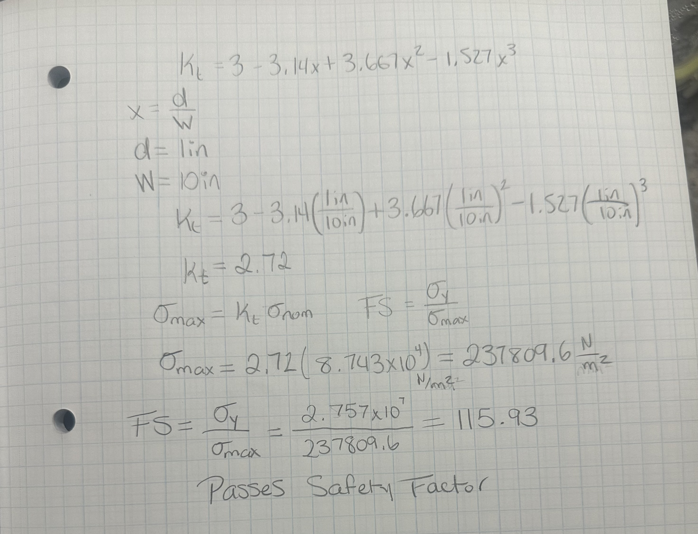
After getting the stress concentration factor equation from Peterson's chart and imagining an inch diameter hole (d) and a plate width(w) of 10in.; I was able to use the formula to get a concentration factor value of 2.72. Then imputing this value to fine the maximum stress by multiplying the factor times the max stress experienced on the rod comes out to 237809.6N/m^2. To determine if it would still pass the safety factor, I used the formula SF= yield strength/ stress max. After calculations I got a safety factor of 115.93 satisfying a minimum safety factor of 3.

For this assignment it took me approximately 5-6 hours to complete, including the reading, calucations, testing, and updating portfolio.

## Parametric Design Modification

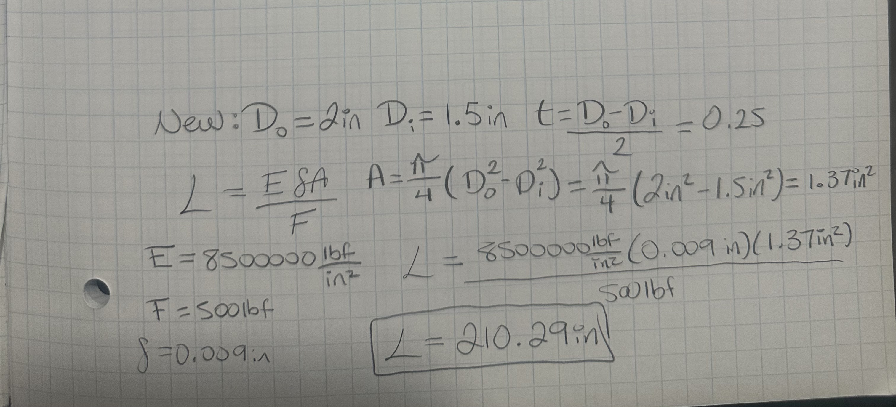
My goal would be to make the length of the rod to decrease. For my new dimensions I'll choose an outer diameter of 2in and inner diameter of 1.5in to create a smaller thickness leading to a smaller cross-sectional area. Calculating the cross-sectional area of the circular hollow bar came out to 1.37in^2. The new thickness of the rod is 0.25in. To accurately compare with the previous calculation, I'll use the 8500000lbf/in^2 modulus of elasticity previously used. After calculations with the parametric design modification the new length minimum is 210.29in. As expected, since the A variable is in the numerator the length output got smaller using a smaller cross-sectional area. 

## CAD Model

[Circular Hollow Rod Tested](https://1drv.ms/f/c/a88588ba91baf92a/IgDZ2mwF0BxsQKX6aOaf-98QAUk5R1o3QSK59xNLE9kdv6s?e=SzNg45)

