# A4 – [Motor Mount]

## Objective
This assignment requires us to design a motor mount using the (Brushed 24V DC Gear Motor 3.6Kg.cm/46RPM w/ 99.5:1 Planetary Gearbox) which attaches to the rigid wall A. For both features, first design for yield strength and then design for a maximum deflection of .30 mm at the free end. ABS, PETG,  or PLA may be selected as a motor mount material. When designing the motor mount take into account a safety factor of 3 and neglect the weight of the motor. For steps 1 and 2 draw a FBD of the forces and a concept of the design. Research the design of different motor mounts and place the links in an appendix on the page. Make justifiable approximations in the design to simplify the analysis. (ie. use the beam calculations) Follow Appendix B for the initial approach to set up the design analysis.

Figure 1: Shows motor, the rigid wall and the force received on the shaft of the motor, where P = 300 N

Appendix A:

Appendix B:

## Motor Mount Research
From 2 websites that I looked into some of the different motor mounts displayed were ones with some "ears" and conical mounts. Rubber engine mounts are great for dampening noise levels. Stiffer motor mounts are the opposite; their issue is vibrations. Although stiffer motor mounts lead to greater maximum output of the engine. Also, it is noted that the size of the motor mount doesn't need to cover the whole length, as its main purpose is to hold the engine in place.

## Feature 1

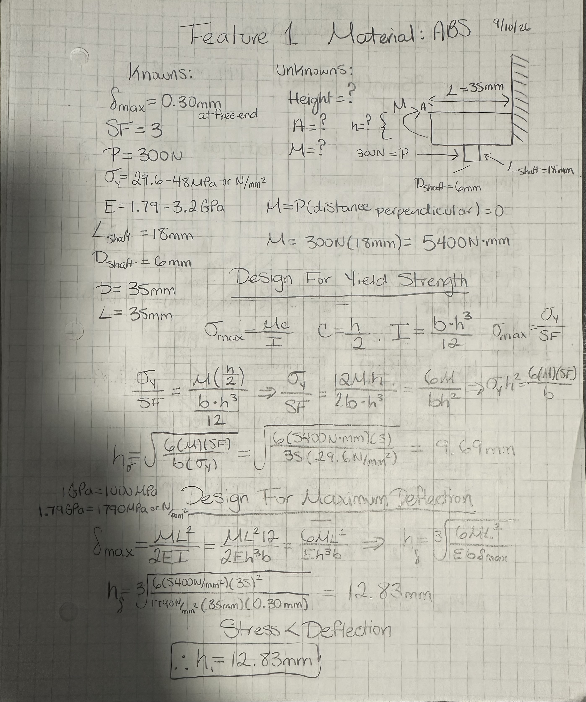

First, I listed all my knowns and unknowns. I decided to use ABS material and chose the lowest stress yield and modulus of elasticity within the range given for the material. Stress yield=29.6 N/mm^2 and modulus of elasticity=1790N/mm^2. Then I decided the length and base of feature one to be 35mm both sides, to create a nice, squared shape. After, I needed to find the bending moment at point A of feature one by multiplying the force times the distance from A perpendicular to the force, 300N times the 18mm. Using the stress maximum formula, I substituted for known variables and rearranged to solve for the height. I made sure to convert all my values so I could get an accurate answer. After testing for the minimum height required for yield strength and maximum deflection, I found my value for the height of feature 1 to be 12.83mm. Since the height minimum for the maximum deflection design is higher than the design for yield strength, I need to use the height calculated for maximum deflection. That way the motor mount won't fail to satisfy both the yield strength and the max deflection.

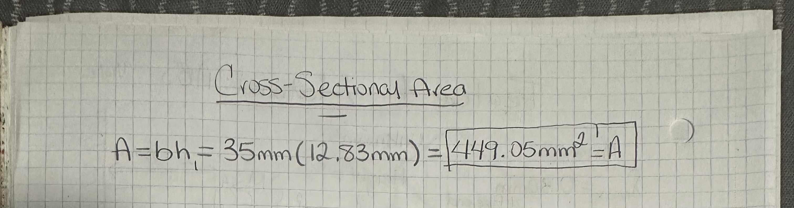

To find the area of the rectangle I multiplied it's base times the height value calculated. The area is 449.05mm^2.

## Feature 2

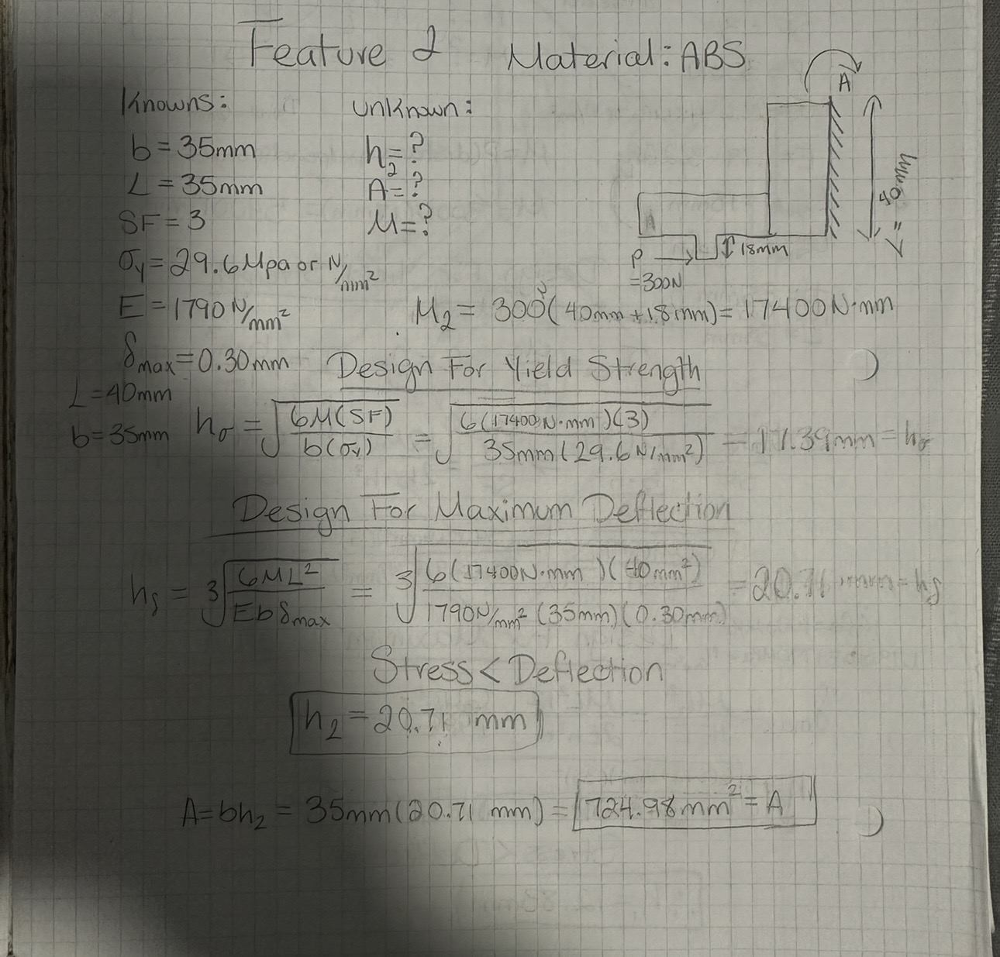

To create my second feature the process was identical to create feature 1. I chose the same material, ABS, with the same yield strength and modulus of elasticity. Initially I had chosen a length of 60mm to cover most of the motor, but later on I changed that to reduce the height for feature 2. I didn't want to have a high value for height because that would make the motor mount look unappealing. Therefore, I went with a length of 40mm by a base of 35mm. After figuring it out I calculated moment 2 to be 300N multiplied by (40mm+18mm) which is the perpendicular distance from point A to the force. Like previous the design for yield stress had an output for a lower minimum diameter required of 17.39mm. While the design for maximum deflection had a height value of 20.71mm. Like previously the higher height value was chosen to prevent permanent deformation and elongation past 0.30mm. The area for feature 2 came out to be 724.98mm^2 using the height calculated for feature 2.

## Sketch

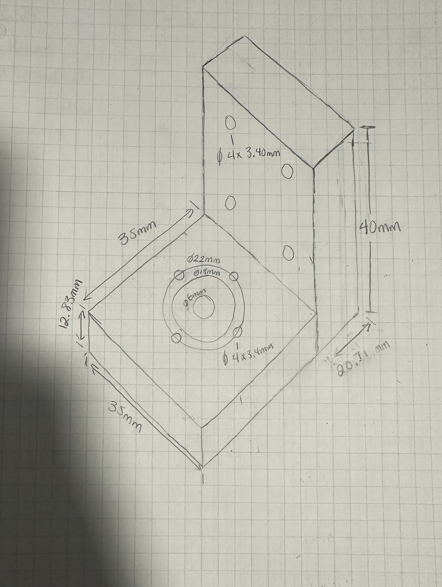

This is the 3D sketch of how my design on SolidWorks will look like, with the dimensions.

## CAD Model

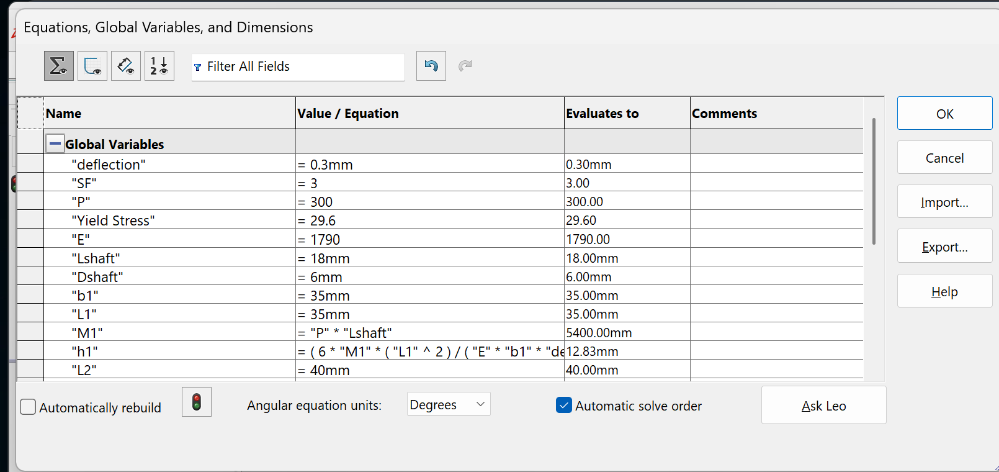

Input of all my global variables and caluclating for both heights.

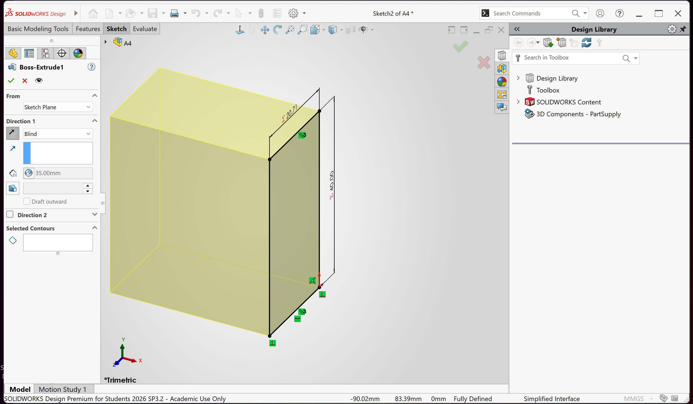

I decided to draw out the features separately and started with feature 2. I used global variables to input for the dimensions of the features.

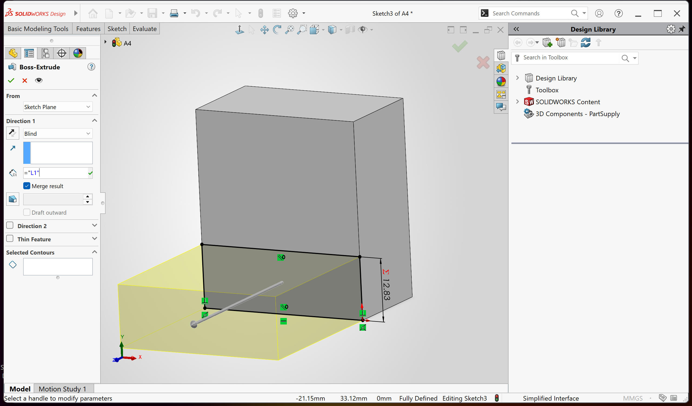

Afterwards, I sketched feature 1 after the base of feature 2 was finished and made sure to input height from calculations for feature 1 using global variables. Extrusion was global variable "L1" or 35mm.

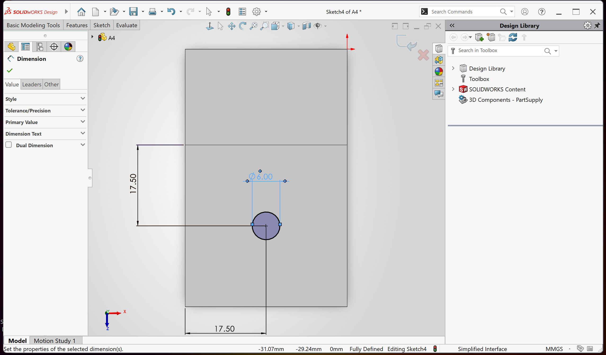

I made sure the motor mount would go in the center of feature 1 and drew out the diameter for the shaft of the motor to extrude cut it all the way through.

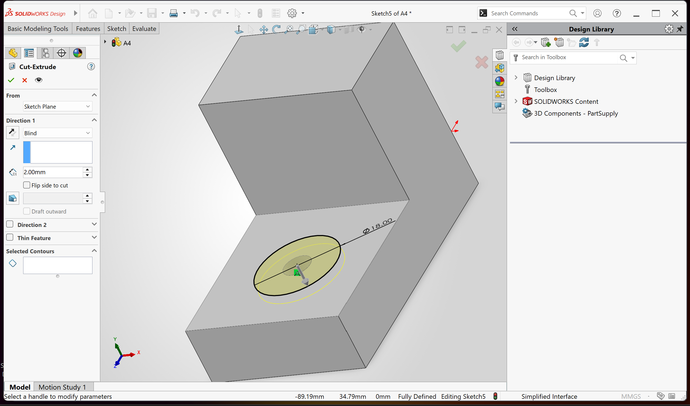

I also realized the additional space the motor mount needed and added the alignment pocket to be 2mm in depth.

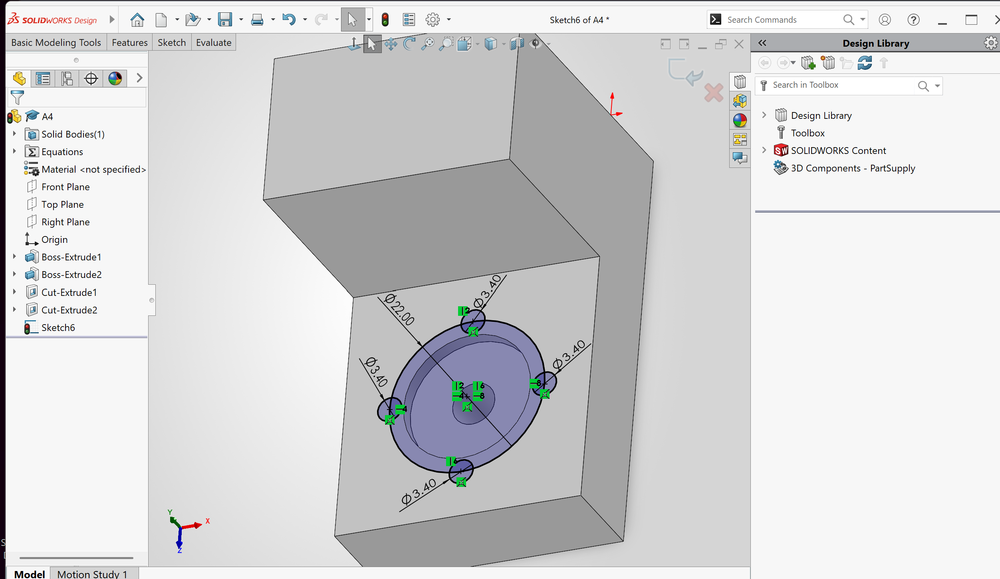

The 22mm diameter circle was used just for reference of where the bolt holes would be located.

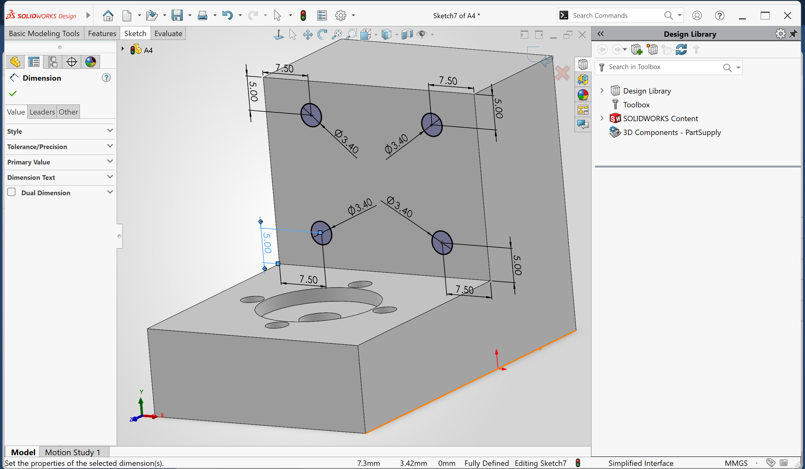

After, I was done with all the extruded cuts in feature 1 I moved onto finishing feature 2 add the 3.4mm diameter clearance holes for the M3 bolts. As well, I made sure to add equal distances for each hole to the horizontal and vertical edge, to make them symmetrical.

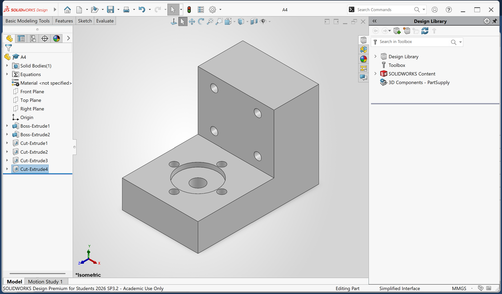

With that the CAD model of the motor mount is complete.

[View A4 Multiview Drawing](A4%20Multiview%20drawing.pdf)

## Lesson Learned

From this assignment I learned how to design a CAD model for an object following its constraints and determining dimensions to withstand a certain force. I was stumbled upon my second moment due to being confused the location of point A, but then later on I found to location of point A on feature 1. With this assignment I also reviewed how to create a multiview sketch drawing in SolidWorks. This assignment took me approximately 5 hours to complete.

## Appendix

[Menon, Author                                            	Kiran, et al. “Solid vs Polyurethane Motor Mounts: Does Material Matter?” Low Offset, 23 Nov. 2024, low-offset.com/workshop/solid-engine-mounts/. ](https://low-offset.com/workshop/solid-engine-mounts/)
[Fuller, David. “Engine Mounts 101: A Basic Guide to Choosing Engine Mounts.” OnAllCylinders, 30 May 2018, www.onallcylinders.com/2016/09/30/engine-mounts-and-motor-mounts/. ](https://www.onallcylinders.com/2016/09/30/engine-mounts-and-motor-mounts/)

