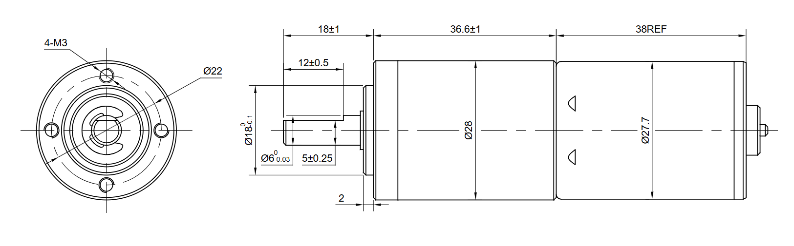
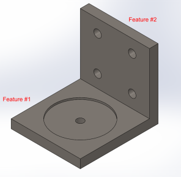

# A4 – [Motor Mount]

## Objective
This assignment requires us to design a motor mount using the (Brushed 24V DC Gear Motor 3.6Kg.cm/46RPM w/ 99.5:1 Planetary Gearbox) which attaches to the rigid wall A. For both features, first design for yield strength and then design for a maximum deflection of .30 mm at the free end. ABS, PETG,  or PLA may be selected as a motor mount material. When designing the motor mount take into account a safety factor of 3 and neglect the weight of the motor. For steps 1 and 2 draw a FBD of the forces and a concept of the design. Research the design of different motor mounts and place the links in an appendix on the page. Make justifiable approximations in the design to simplify the analysis. (ie. use the beam calculations) Follow Appendix B for the initial approach to set up the design analysis.

Figure 1: Shows motor, the rigid wall and the force received on the shaft of the motor, where P = 300 N

Appendix A:

Appendix B:

## Feature 1

## Feature 2

## Sketch

## CAD Model

## Decide

## Communicate

