# A5 – [Bracket Design]

## Objective

-Conduct stress analysis to determine appropriate dimensions for structural features.

-Generate free body diagrams (FBDs) to visualize forces and constraints for each feature.

-Identify and document known and unknown variables, assumptions, and algebraic models for stress calculations.

-Perform stiffness analysis to establish minimum required dimensions based on deflection constraints.

-Compare stress and stiffness analyses to ensure structural integrity and compliance with given constraints.

-Create detailed multiview sketches illustrating dimensions derived from both stress and stiffness analyses.

-Reflect on and document key engineering lessons learned throughout the process.

## Analyze

Detail design a bracket, using the concept design in Appendix B, to hold a horizontal force applied symmetrically by a strap outline in resource #1. The bracket’s dimensions are designed with different fit classes. Each dimension of the T beam is part of the fit:

“a” intention for use where accuracy is not essential
“b” is about the closest fits that can be expected to run freely
“c” is where accurate location and minimum play is desired

Design using a safety factor of 4 and applied load in between 500 lbf < F < 800 lbf. Choose one of three metals, aluminum 6061 T6, Steel (ASTM A36), or Titanium (Ti-6Al-V4). Furthermore, state assumptions and approximations about the design in order to use fundamental strength of materials analysis. For example, use the proper stress analysis and deflection analysis where appropriate. Assume no failure due to direct shear stress. 

## Stress Analysis

First of all, for this assignment I chose the material Steel (ASTM A36). I researched the property materials from [here](https://beamdimensions.com/materials/Steel/ASTM/ASTM_A36/#google_vignette), so I would be able to do the stress and deflection analysis. I made sure to convert before doing calculations so the final answer would be accurate. For each feature I listed the knowns and the assumptions made. For every feature it was assumed that it wouldn't fail to shear stress. Additionally, for feature A I assumed the length to be 1/4 greater than the length of the [strap](https://www.uline.com/Product/Detail/S-12925/Poly-Cord-Strapping/Heavy-Duty-Polyester-Cord-Strapping-3-4-x-2500?pricode=WA9239&gadtype=pla&id=S-12925). Also, for feature A the cylinder was treated as a cantilever beam Therefore, a distinct formula was used to calculate the section moduli (z) first, then use the z value to find the radius of the cylinder. [This website](https://www.structuralbasics.com/section-modulus/) helped me view the different section moduli formulas dependent of geometric shape. Feature C had another distinct formula, due to the bending that it experiences, where I had to solve for the section moduli first and then input into another formula. For the other 3 features I used the formula of the force times the safety factor divided by A equals the yield stress. Rearranging for cross-sectional area and later using the area value to find the unknown height, length, or width by equaling the cross-sectional area to the formula for the geometric shape.

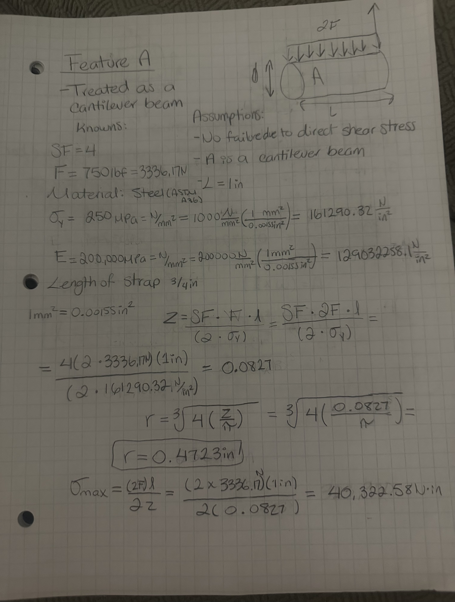

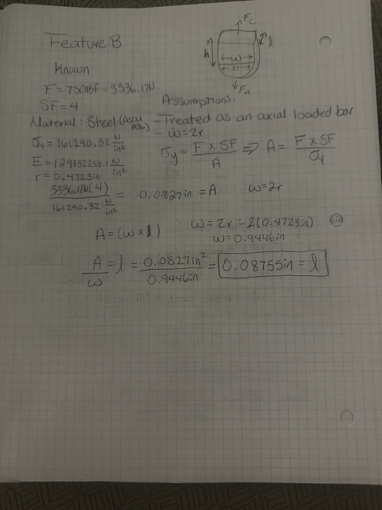

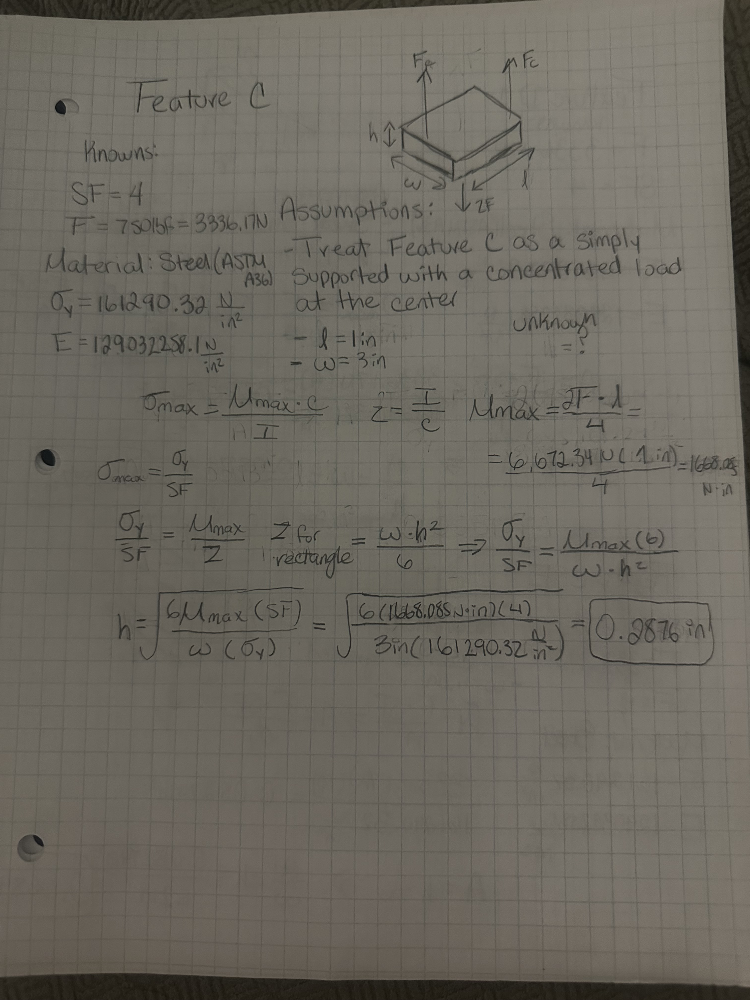

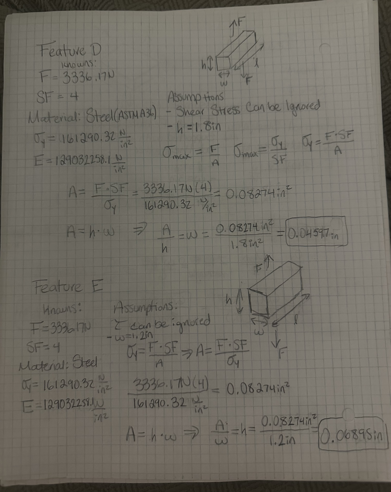

## Stiffness Analysis

For the Stiffness Analysis the process was very identical to the Stress Analysis. the main difference was the change in formulas.

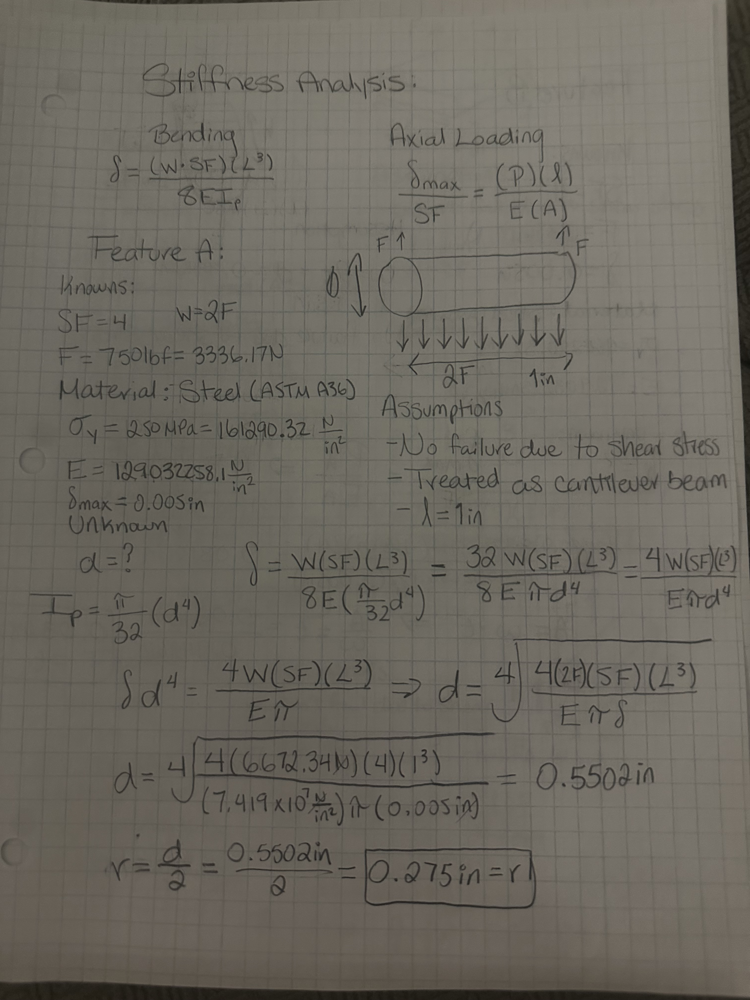

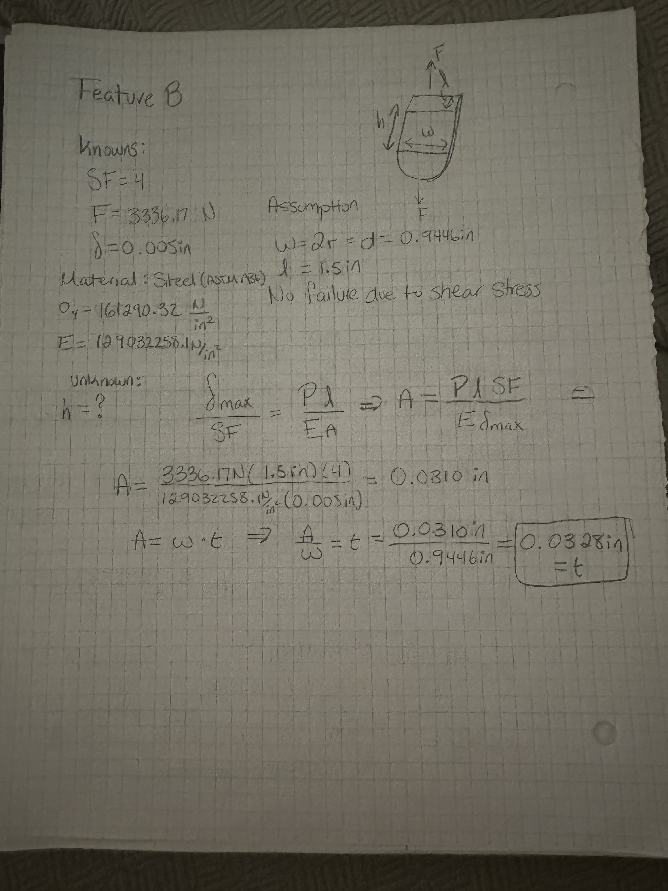

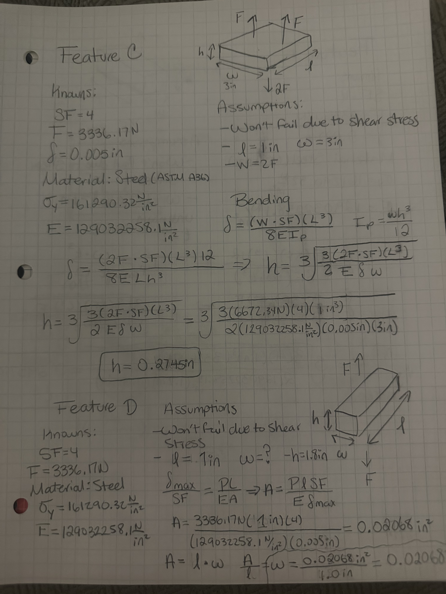

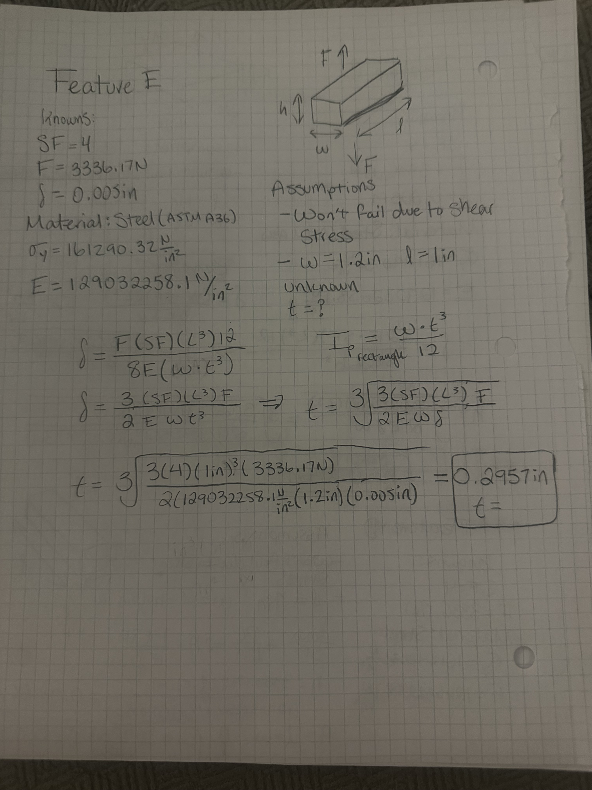

## Multiview Drawings

These are the multiview drawings, one for Stress Analysis and one for Stiffness Analysis, of the top, front, and left view. Both multiview drawings are dimensionalized to view the different dimensions calculated from the Stress Analysis and the Stiffness Analysis.

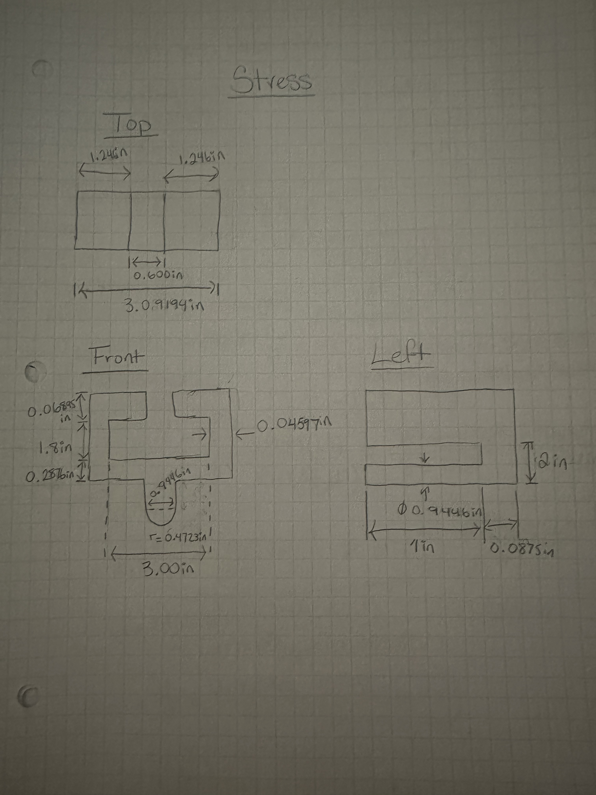

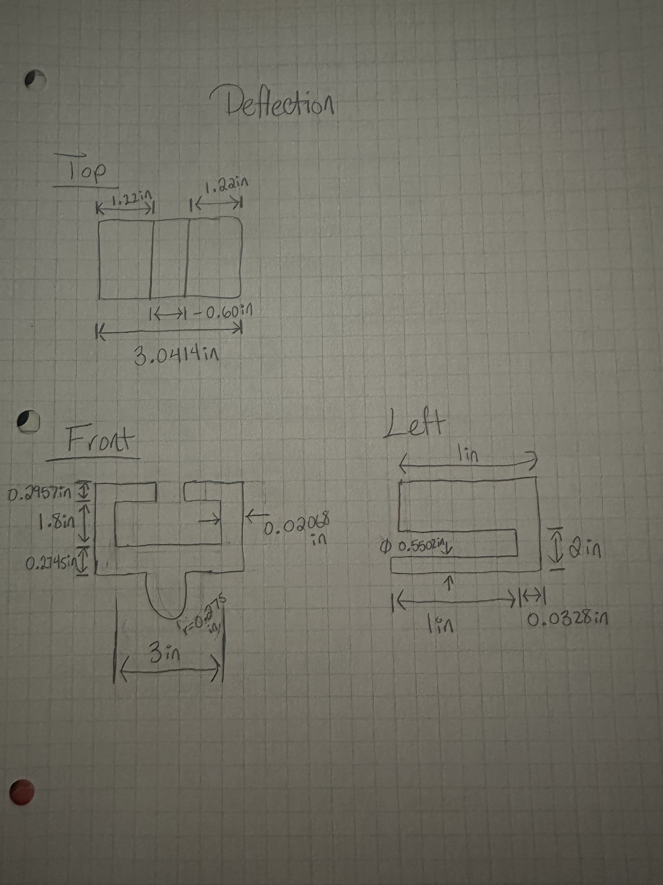

## Engineering Lesson

From this assignment I learned to think critically when designing a product that needs some specific dimensions. I learned how to incorporate specific dimensions, my own, and to calculate for another using two different types of tests, Stress and Stiffness Analysis. For feature A the Stress Analysis governs because it's a greater value compared to the value result from the Stiffness Analysis. The greater value governs because it will not fail under stress nor deformation. My radius diameter from the Stress Analysis is 0.4723in compared to 0.275in from the Stiffness Analysis, the Stress Analysis yielded a value almost 2 times greater. At first, I had made length of feature C and D different, then I realized that they must be the same. This is essential because different scenarios lead to different end values. Throughout all the calculations it was assumed the material was Steel (ASTM A36), wouldn't fail to shear stress, bracket is supported by one side, and that the load was evenly distributed. Expected for feature C where we were told about a concentrated load at the center. If I changed my assumptions my final answer would have to be reevaluated. For example, if I were to assume the bracket is supported by two rigid walls the formulas would change, therefore, lead to different calculations.  Initially I had chosen titanium as the material but switched to steel due to high costs, difficulty to manufacture, and the higher likelihood of failing under bending moment compared to steel. I spent roughly about 8 hours on this assignment.

## 2157 Fits
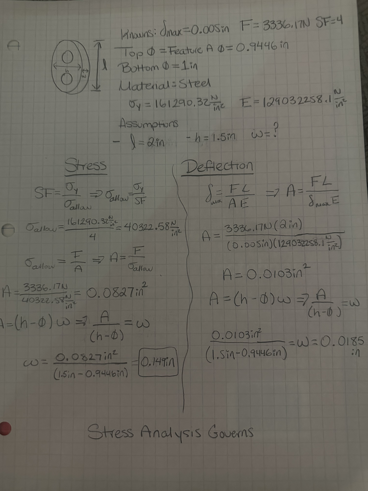

For this part of the assignment, I decided to continue using Steel as the material with the same force applied of 750lbf. The top diameter of the circle is the diameter of feature A, 0.9446in. Additionally, I decided to make the length of the link 2in and the height 1.5in so that the width(thickness) wouldn't be similar value to that of the height. After performing calculations to find minimum the cross-sectional area and width it was observed that the Stress Analysis governed. The Stress Analysis calculations had a higher cross-sectional area and width, letting me know it's the value needed in the design to withstand the forces.

Feature A:

The fit for feature A must be a running/sliding fit, so I chose an RC4 because it is a "close-running" fit meaning it has some but limited freedom to move. For within my diameter size (0.9446in), range 0.71-1.19, and choosing a RC4 fit the tolerance for the hole is +0.002 to 0 and for the shaft -0.008 to -0.016. With a hole product H8 and shaft production f7. The manufacturing process would be to drill undersize, ream to size on a CNC Lathe using a toolholder. 

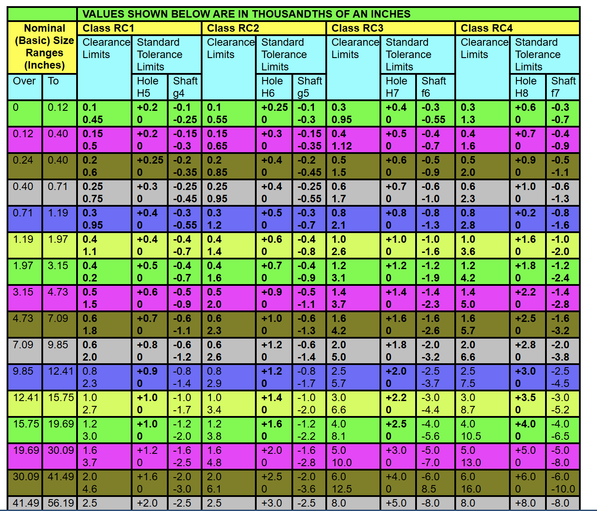
[Chart](cobanengineering.com/Tolerances/ANSIRunningSlidingFits.asp.)

1.0in Shaft:

For the 1.0in shaft the design must be with light assembly pressure. Therefore, I selected a FN1 fit and since the diameter of the circle is 1.0in it is still within the 0.71-1.19 range. The hole H6 tolerance is +0.005 to 0 and for the shaft n5 the tolerance is +1.00 to +0.500. The manufacturing process for an LN1 fit I would select is turning on a high precision machine.

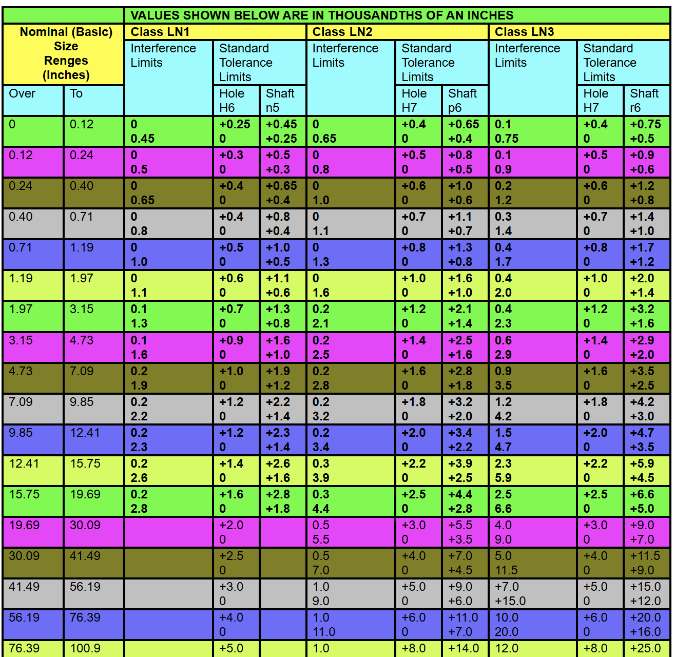
[Chart](cobanengineering.com/Tolerances/ANSIForceFits.asp.)

## Appendix

-[“ANSI B4.1 Standard FITS - RC, LC, LT, LN and FN Classes.” Mech Codex, mechcodex.com/reference/ansi-standard-fits. Accessed 24 Sept. 2026.](mechcodex.com/reference/ansi-standard-fits.)

-[“ASTM A36 Steel Properties.” Beam Dimensions | Section Properties and Dimensions, beamdimensions.com/materials/Steel/ASTM/ASTM_A36/#google_vignette. Accessed 24 Sept. 2026.](beamdimensions.com/materials/Steel/ASTM/ASTM_A36/#google_vignette.)

-[Coban Engineering -. ANSI Limits and Fits, Interference Fits,Force Fits,Shrink Fits, ANSI Limits,ANSI Shaft Limits, ANSI Holes Fits, cobanengineering.com/Tolerances/ANSIForceFits.asp. Accessed 24 Sept. 2026.](cobanengineering.com/Tolerances/ANSIForceFits.asp.)

-[Coban Engineering -. Running and Sliding Fits,ANSI Limits and Fits,Limits and Fits,Ansi Hole and Shaft Tolerance, cobanengineering.com/Tolerances/ANSIRunningSlidingFits.asp. Accessed 24 Sept. 2026.](cobanengineering.com/Tolerances/ANSIRunningSlidingFits.asp.)

- [Engineers Edge, LLC. “Standard Tolerance Limits Fits ANSI B4.1: GD&T Tolerances.” Engineers Edge - Engineering, Design and Manufacturing Solutions, www.engineersedge.com/mechanical,045tolerances/preffered-mechanical-tolerances.htm. Accessed 24 Sept. 2026.](www.engineersedge.com/mechanical,045tolerances/preffered-mechanical-tolerances.htm.)

  -[Ernst, Laurin. “Section Modulus Formulas for Different Shapes {2026} - Structural Basics.” Structural Basics - Structural Engineering for Everyone., 8 Feb. 2026,](www.structuralbasics.com/section-modulus/.) 

