# A6 – [Topic]

## Objective

This week's assignment is a continuation from last week designing the bracket by taking the modeling from last week to create a parametric model and a detailed engineering drawing. As part of this assignment, I will need to generate a comprehensive solid model and a multi-view engineering drawing that accurately represents the designed bracket, incorporating all features to ensure both strength and stiffness requirements are met.

## Parametric Design
From last week the goal was to find a dimension that would satisfy a deflection under 0.005in and a dimension that wouldn't fail under stress by using the yield stress of the material. Below are the multiview drawings of both the Stress and Stiffness Analysis, the greater value for each feature is the dimension that will be used in the CAD model design to assure satisfaction to both conditions. Also, since the goal is to satisfy both the stress and deflection condition the final design will contain dimensions from both the Stress Analysis and the Stiffness Analysis.

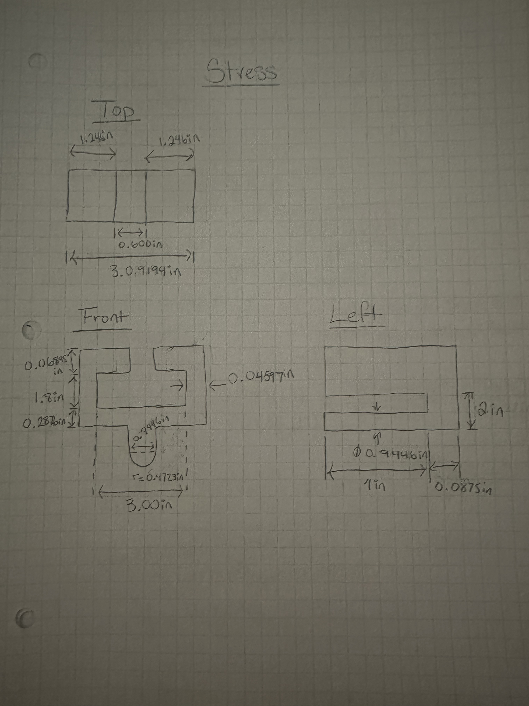

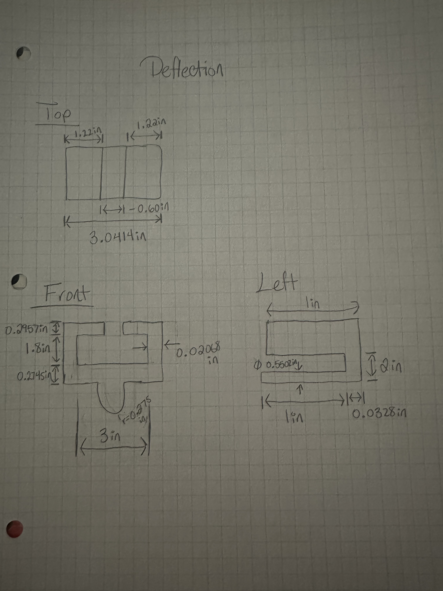

## Final Parametric Design Selection

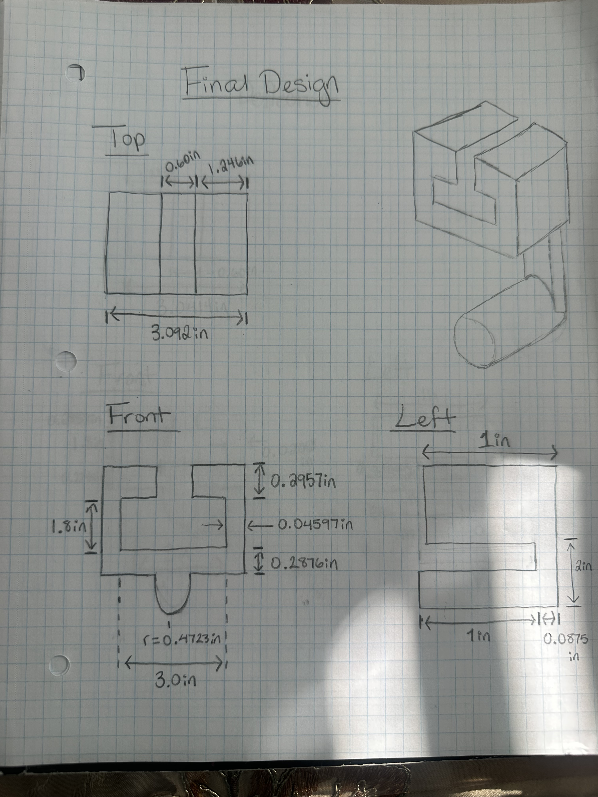

After analyzing both the dimension values from the stress and stiffness analyzing 4 of the 5 calculated dimensions came from the stress analysis, always choosing the greater value.

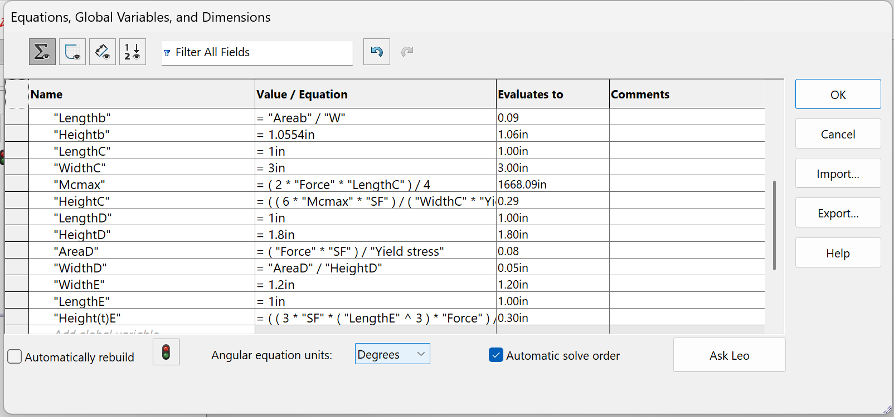

Then, I launched SolidWorks to input the assumed dimensions and calculated dimensions into the global variable feature.

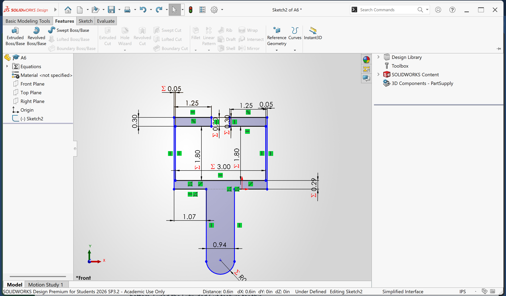

After finishing creating the global variables, I was ready to model the design using the global variables to input the dimensions of the design.

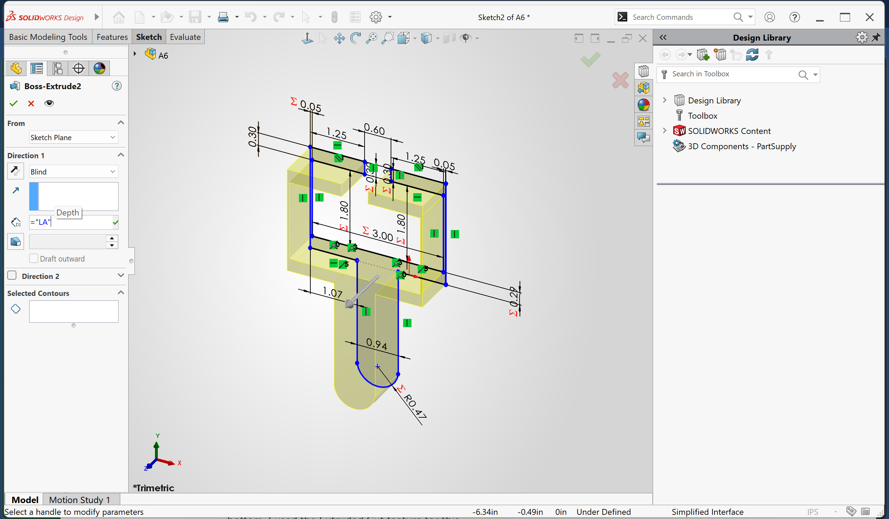

I had extruded the entire design 1 in, the length of feature top bracket. Therefore, I had to then to add another 0.875 to the length of feature A and B so the length of A+B could be 1.0875. 

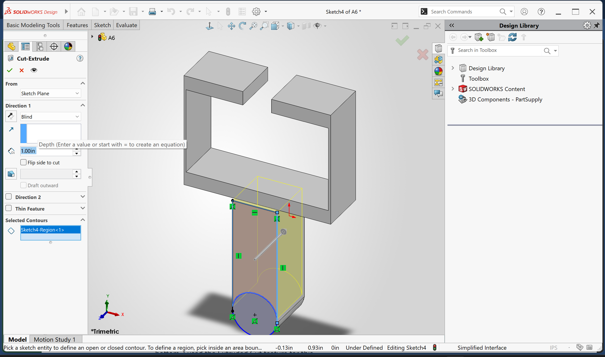

For feature B I cut extruded 1 in so feature B width could be 0.0875

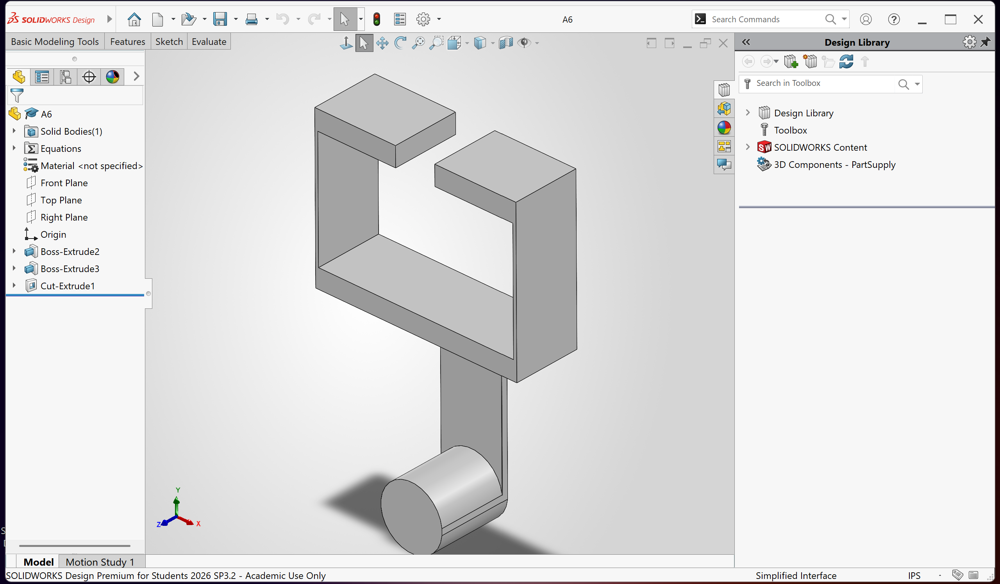

The final CAD model of the bracket design.

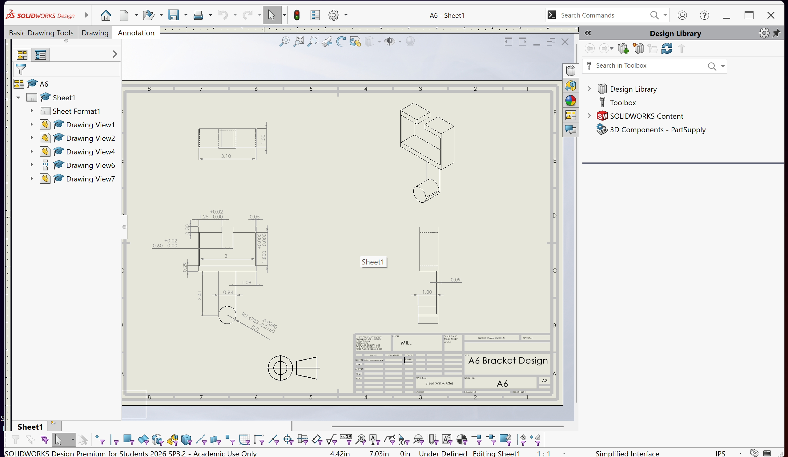

The multiview drawing of the bracket design. Also, since feature A has a link, I had chosen an RC4 fit so it could fit pretty smoothly. Therefore, the shaft (cylinder) for feature A has a tolerance of -0.008 to -0.016. Additionally, I added tolerances to 3 other tolerances, for the t design.
## Bracket Reflection

Since the only feature in which stiffness governed was feature E there was only one stiffness calculation used for the final design. This specific dimension calculated for feature E controlled the width of the feature. All the calculated dimensions using the stiffness and stress analysis in the final design was inputted into SolidWorks expressed as an equation using the "equation" feature. The CAD calculation and the hand written calculation were identical.

## 2157 Link

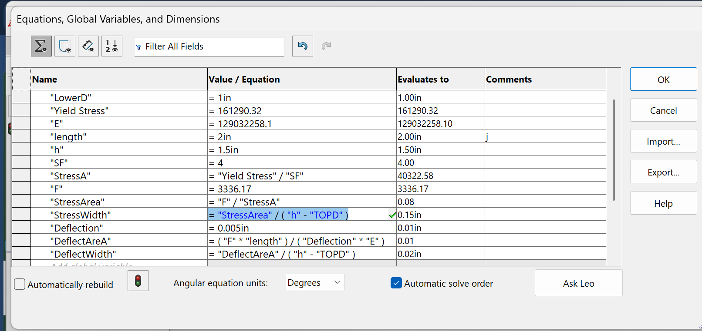

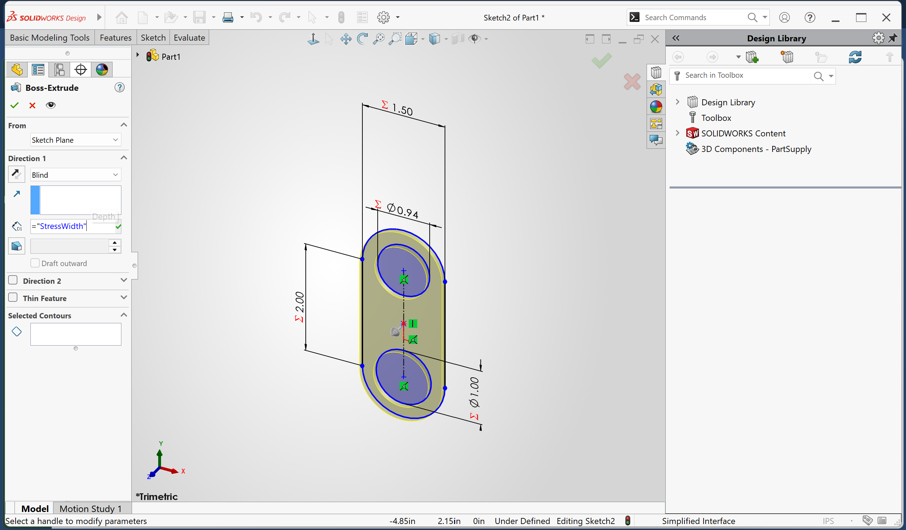

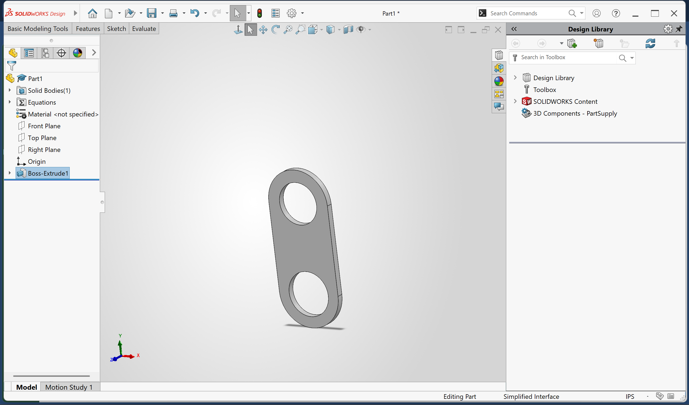

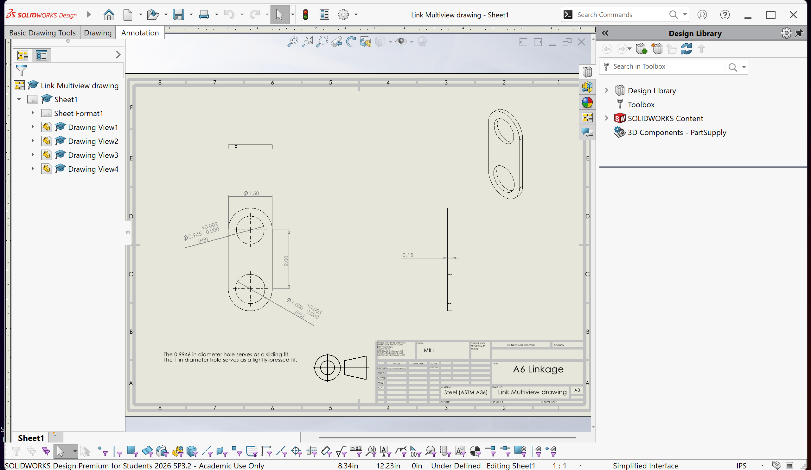

## Linkage Reflection

